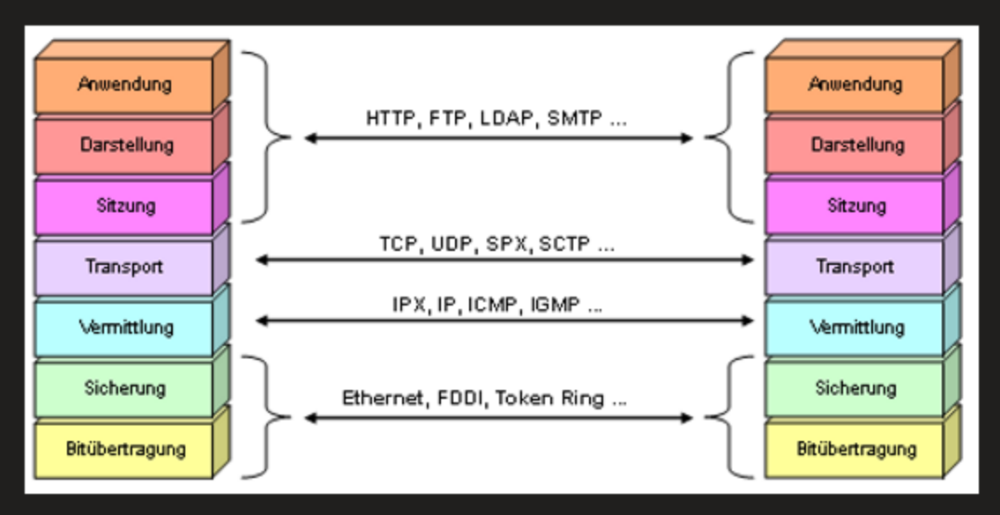
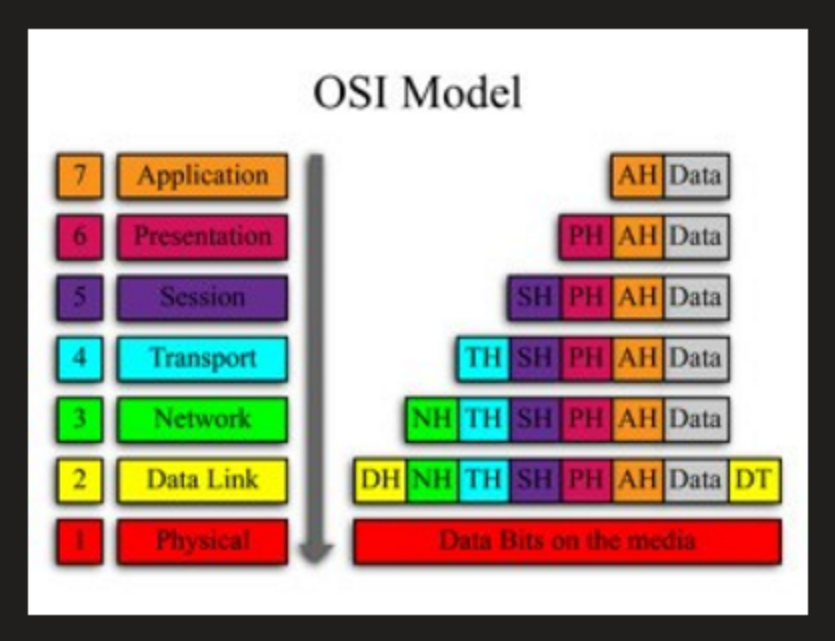

3 Modelle und Organisationen
============================

| TCP/IP Modell | HArdware | OSI Modell |
|:--- |:--- |:--- |
|   |   | Application |
| Application |   | Presentation |
|   |   | Session |
| Transport |   | Transport |
| Internet | Router, MLS (L3 Switch) | Network |
|   | L2 Switch | Data Link |
| Network Access | Hub, Kabel, NIC, Repeater | Physical |

#### Organisationen und Standard
NGO, Anbieter neutral

##### Vorteil
- Zusammenarbeit zwischen den Anbietern
- Wettkampf
- Innovation
- Keine Monopole

#### Nummern und Adressen:
- ICANN (Interner Corporation for Assigned Names and Numbers)
- IANA (Internet Assigned Numbers Authority)
- Aufgaben: IP-Adressen vergeben, Domain Vergabe, Ports festlegen, …

#### Protokolle:
- ISOC (Internet Society)
- IAB (Internet Architecture Board)
- IETF (Internet Engineering Task Force)
- IRTF (Internet Research Task Force)

#### Elektronik Standards:
- IEEE (Institute of Electronics Engineers)
- EIA (Electronic Industries Alliance)
- TIA (Telecommunications Industry Association)

#### Wiederholung:

