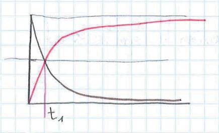
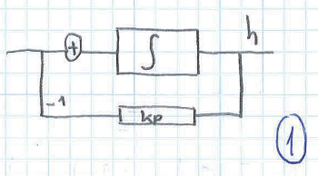
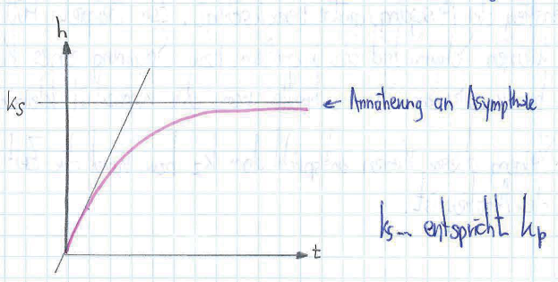
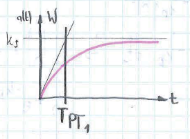
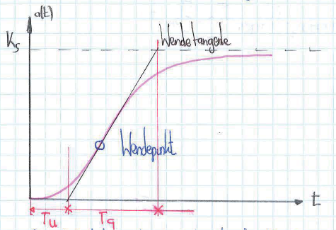
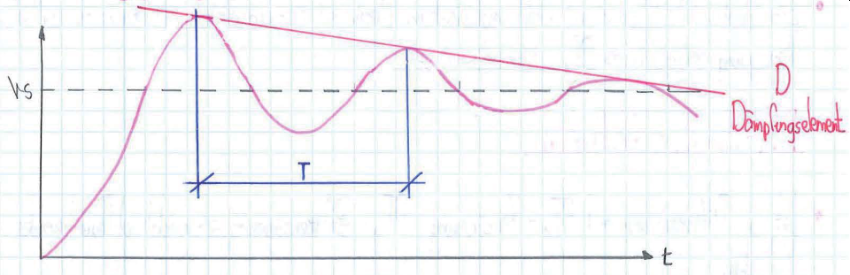
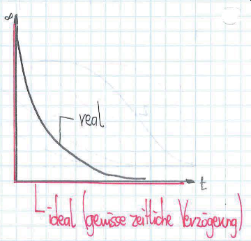
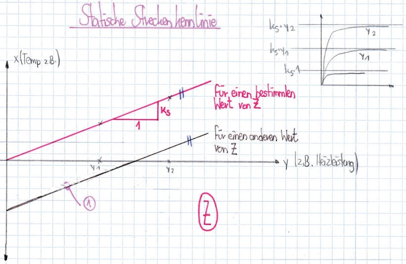

Regelungstechnik
================

Technische Systeme werden gesteuert und überwacht
Jede Regelung hat eine Steuerung.

Bsp.:
> In der Früh gehe ich duschen und stelle mir das Wasser heiß ein (Steuerung) \
> Dabei merke ich, dass es zu heiß ist und ich möchte kälter stellen (Regelung) \
> Ich stelle das Wasser kälter ein (Steuerung)

```
W ... Sollwert {zB 25°C}
x ... Istwert {zB 20°C}
y ... Stellgröße {Ausgang des Reglers zB 70%}
E ... Regelabweichung = W - x
```


Regelung hat immer eine Rückkopplung. \
Ziel ist immer die Strecke zu verändern.

Regelung ist wenn man nach dem Steuern nochmals steuert anhand der Sensoren (Dusche)
Sollte man die Dusche einstellen und nicht weiter ändern, so ist das steuern. Korrigiert man diese Einstellung, regelt man.

Überlegungen:
- Welche Regler?
- Wie schnell, wie stark?
   - Darf der Istwert über den Sollwert?
   - Wie weit darf der Istwert über den Sollwert?
   - Je nach Anwendungszweck zu entscheiden und definieren
- Was generell?
- Muss zur Strecke passen      auch Heizung, etc dabei

# Was wollen wir?

## 1 Das Führungsverhalten


- Unter _Führungsverhalten_ versteht man die zeitliche Reaktion des Regelkreises auf einen Sprung des Sollwertes.

**Sprungantwort**
- Unter _Sprungantwort_ versteht man den zeitlichen Verlauf der Ausgangsgröße eines regelungstechnischen Elements oder des Regelkreises wenn am Eingang zum Zeitpunkt 0 ein Sprung der Höhe 1 erfolgt (Einheitssprung)
   - Führungsverhalten ist die Sprungantwort des ganzen Regelkreises im Bezug auf die Eingangsgröße *W*
**Achtung:** Genau unterscheiden wovon man die Sprungantwort beachtet!
Sprungantwort von Regler kann zwar sofort auf 100% gehen, aber Sprungantwort vom Sensor kann sehr träge sein

Je nachdem wie sich der Regler verhält, verhält sich die Strecke und die Sensoren. Sie reagieren alle anders, aber in Abhängigkeit der anderen Teile



Schwarze Linie ist Abbau der Temperatur, Rot ist der Aufbau
<br><br>
- Beispiel:
   - Mit einer Heizung auf 20°C heizen. Bei 2 Heizungen "dauert" es halb so lang, allerdings gleich lange wie wenn man auf 40°C heizen würde.
   - Praxis: Effekt sichtbar, da Dauer halbiert
   - Theorie: Wenn 2 Heizungen verwendet werden, muss auch erwartete Temperatur verdoppelt werden (ALLES!), damit Sprungantwort am Ende die Gleiche ist
   - Verdopplung der Leistung = doppelt so hoher Sprung = halbe Zeit


----

## 2 Störverhalten

- Störfaktoren
   - Lampen
   - Menschen
   - Fenster
   - EDV-Geräte
   - Raumgröße (wirkt auf die Strecke, aber ist kein direkter Störfaktor)

Auf die Strecke wirkt die Störgröße **Z**

Das Störverhalten ist die Sprungantwort des ganzen Regelkreises in Bezug auf die Eingangsgröße **Z**

Das Störverhalten ist zB ein geöffnetes Fenster im Winter, wenn man Heizen möchte. 


Der Störfaktor **Z[0]** weist einen Einheitssprung auf (Ein Fenster wird geöffnet) \
Dadurch sinkt die Temperatur (**x** steigt) \
Dann wird **y** so eingestellt, dass der gestiegene Störfaktor kompensiert wird (**x** sinkt wieder runter) \
Im Idealfall sinkt **x** dadurch auf den originalen, gewünschten Wert herunter. In der Praxis kann dies nicht umgesetzt werden, lediglich eine Näherung.

----

|      | Beispiele                         |                                            |
|:---- |:---------------------------------:|:------------------------------------------:|
| Bsp1 | **x** = Zimmertemperatur          | **Z** = Wärmeverlust durch Außentemperatur |
|      | **y** = Heizleistung              |                                            |
| Bsp2 | **x** = konstante Geschwindigkeit | **Z** = Gefälle oder Steigung              |
|      | **y** = Treibstoffzufuhr          |                                            |
| Bsp3 | **x** = Drehzahl                  | **Z** = Lastdrehmoment                     |
|      | **y** = Umdrehungen               |                                            |

Zu viel CO2 im Blut schneller Atem

<table>
   <tr>
      <td>Helligkeit</td>
      <td><strong>x</strong> = Lichteinfall im Auge</td>
      <td><strong>Z</strong> = illegale Substanzen</td>
   </tr>
   <tr>
      <td></td>
      <td><strong>y</strong> = Pupillenöffnung</td>
      <td></td>
   </tr>
   
   <tr>
      <td>Helligkeit</td>
      <td><strong>x</strong> = Zuckergehalt im Blut</td>
      <td><strong>Z</strong> = Zucker</td>
   </tr>
   <tr>
      <td></td>
      <td><strong>y</strong> = Insulinproduktion</td>
      <td></td>
   </tr>
</table>

----

Negative Rückkoplung:

Die Preisbildung durch Angebot & Nachfrage ist ein Beispiel für negative Rückkopplung. Ein bestimmter Effekt (geringe Nachfrage) hat eine Konsequenz, die diesem entgegengerichtet ist. => System pendelt sihc in einen stabilen Zustand ein.


<table>
   <tr>
      <td></td>
	  <td style="text-align: center">
	     <strong>Beispiel Laptop-Verkauf</strong>
	  </td>
	  <td></td>
   </tr>
   <tr>
      <td>W</td>
      <td>gewünschter Preis</td>
      <td>€</td>
   </tr>
   <tr>
      <td>y</td>
      <td>Angebot</td>
      <td>Stück</td>
   </tr>
   <tr>
      <td>x</td>
      <td>aktueller Preis</td>
      <td>€</td>
   </tr>
   <tr>
      <td>E</td>
      <td>W - x</td>
      <td>€</td>
   </tr>
</table>

Negative Rückkopplung ≘ **x** steigt, **W** sinkt; und anders herum \
Positive Rückkopplung ≘ **x** steigt, **W** steigt; und anders herum

Positive Rückkopplung ist in der Wirtschaft meistens eine Blase => Nachfrage steigt, Preis steigt. \
Bis zum Kippen der Richtung. Nach dem Kippen sinkt die Nachfrage und der Preis sinkt.

----

## 3 Typische Regelstrecken (regelungstechnische Elemente)

### P-Element (Proportionalelement)

- Nicht mehr proprotional dazu ist zB die Motordrehzahl, weill das Fahrzeug beschleunigt werden muss.
- **A(t)** = **k[p]** \* **E(t)**
- Ausgangswert = Proprotionalitätsfaktor des p-Elements \* Eingangswert

### Totzeit-Element

Siehe Förderband: Kies wird auf Förderband gelegt und benötigt eine gewisse Zeit (= Verzögerung), damit der Kies im System ist.

Beispiel: Handy ausschalten: Ausschalten-Knopf gewisse Zeit gedrückt lassen, bis sich das Handy ausschaltet. Diese Verzögerung ist die **Totzeit** und das Bauelement ist das **Totzeit-Element**

### Integrierer (I-Glied (ohne Verluste))

- Für was brauchen wir Integration?
   - Wenn man auf etwas warten möchte
   - Wenn man eine Fläche berechnen möchte (= Integrieren in a nutshell)
      - Was bringt das?
	     - Tank
		    - Zufluss ist linear
			- Füllstand ist das Integral vom Wasserstand
- Wenn man regelungstechnische Elemente allgemein betrachtet (nicht auf eine konkrete Anwendung bezogen, so sind die Eingangs- und Ausgangsgrößen immer dimensionslos)
- Ein I-Glied wird durch **k[I]** charakterisiert, bis die Ausgangsgröße gleich 1 ist.
- Ein weiteres Beispiel für ein I-Glied ist das Aufheizen einer Box, wenn diese keinen Energieverlust an die Umgebung hat (Thermobox)

### Integrierer mit Verlust

- zB Tank mit Abfluss mit Füllmenge = proprotional zu Füllhöhe.
   - Maximale Füllhöhe ist erreicht, wenn ``h \* k[p] = "``. Das heißt es fließt gleich viel ab, wie zu.
- Nähert sich asymptotisch an ``k[S] = Sprungantwort`` an
- Anderes Beispiel:
   - Zimmertemperatur steigt durch Heizleistung an -> Verlustwärme geht an Umgebung und ist immer präsent
- Desto näher man am Sollwert ist, desto langsamer nähert man sich dem Sollwert.




----

### Wiederholung Schwingungen aus Physik

- Schwingfälle
   - Schwingfall
      - Schwingung schwingt über und wieder darunter.
	  - Pendelt sich langsam in den Soll-Wert ein
   - Kriechfall
      - Schwingt niemals über den Soll-Wert.
	  - Dauert relativ lange.
   - Aperiodischer Grenzfall
      - Schwingt einmal etwas über den Soll-Wert.
	  - Pendelt sich nach einmaligem Überschwingen direkt auf den Soll-Wert ein.

----

### PT1-Element (Differenzialgleichungselement, Zahl steht für die Ordnung der Gleichung)

- Regelungstechnische Elemente lassen sich durch Differntialgleichungen beschreiben
   - unabhängige Variable = Zeit ``t``
   - Lösungsfunktion = Ausgangsgröße
   - Störfunktion = Eingangsgröße



**Bemerkung:** \
**Wir werden nur Fälle betrachten, wo PT1-Elemente zum Startzeitpunkt und Ausgang den Wert 0 haben. Bei ANA-Simualtionen ließe sch ein entsprechender Startwert vorgeben**

### PT2-Element

Dies wird für Schwingungen verwendet.

Im Grunde sind Schwingungen unerwünscht, außer man möchte schnell den Sollwert erreichen. \
Einer der besten Fälle wäre der _aperiodische Grenzfall_, wo der Istwert ein mal überschwingt und dann direkt auf den Sollwert schwingt.

- Anwendungsbeispiel
   - Aluminium-Hartlöten
      - Kleiner Temperaturbereich
	  - Wenn zu kalt, dann ist Aluminium hart
	  - Wenn zu heiß, dann ist 1 Aluminium-Klumpen

### nicht schwingungsfähiges PT2-Element

Hier verwendet:
   - PT1_1 ... erstes PT1-Element
   - PT1_2 ... zweites PT1-Element
   - PT1_N ... N-tes PT1-Element

Verhält sich gleich wie zwei PT1-Elemente in Serie. **NUR wenn nicht schwingungsfähig** \
Lösung der Differntialgleichung enthält keine Winkelfunktion

Bei PT1_1 passiert ein Einheitssprung und ein Kriechfall folgt daraus. \
Der Ausgang von PT1_1 (=Kriechfall) ist der Eingang von PT1_2 und somit fällt der Einheitssprung weg. \
Der Ausgang von PT1_2 ist somit noch flacher als der Ausgang von PT1_1

Bsp. Kochtopf:
   - Strom ein -> Herd erwärmt sich nicht schlagartig (= PT1_1)
   - Herdplatte erwärmt sich langsam -> Summe erwärmt sich (= PT1_2)
Bsp. Induktions-Herd:
   - Strom ein -> Kochtopf erwärmt sich schnell (= PT1_1)

Anwendungsbeispiel:
   - zwei hintereinander geschaltene Druckluftbehälter mit einer (sehr) dünnen Verbindungsleitung.

###### **_Die beiden PT1 können unterschiedliche Zeitkonstanten haben._**



```
T[U] ... Verzugszeit
T[G] ... Ausgleichszeit
```

Eine Strecke ist umso schwieriger zu regeln, je größer ``T[U]`` ist (= Träge Reaktion der Regelung) und je kleiner ``T[G]`` (= Strecke reagiert stark) ist. \
Wenn ``T[G] = 0``, dann passiert ein _Einheitssprung_ mit einer _Totzeit_ von ``T[U]``.

Parameter für Regelbarkeit:
```T[U] / T[G]```

Tendenziell eine kurze Verzugszeit und große Ausgleichszeit. Damit sind schnelle und genaue Änderungen realisierbar.

Bsp. Dusche:
   - Beim Drehen soll möglichst schnell eine Änderung passieren. (= kleine Verzugszeit)
   - Beim Drehen soll die Änderung nicht sofort so heiß sein, wie eingestellt. (= große Ausgleichszeit)

**Wichtig:**
   - Die Sprungantwort eines PT2-Elements beginnt immer mit einer horizontalen Tangente, die Sprungantwort eines PT1-Elements mit einer gewissen Steigung<strong>!</strong>

### Schwingungsfähige PT2-Elemente

PT2-Element nähert sich dem Sollwert langsam an. Es pendelt sich langsam ein.

Die Abweichung vom Soll-Wert wird nach jeder Periode weniger.

Bsp.:
   - Last an einem Kranhaken verhält sich wie ein gedämpftes Pendel

Eine gut eingestellte Regelung lässt keine Schwingung zu.

### D-Element



```
k[s] ... Sollwert
T    ... Periodendauer
t    ... Zeit
```

Das Element gibt die ``e``-Potenz an, mit der Schwingungsmaxima abfallen



Mit Steigung kann starke/schnelle Regelabweichung frühzeitig erkannt werden.

### DT1-Element = Vorhalteglied


Ist im Prinzip ein verzögertes D-Element

Kann zum Abschalten verwendet, wo nicht sofort alles fertig sein soll.

- ZB.:
   - Beim Wasserhahn kann passieren, dass Knall entsteht, wenn Hahn schnell ganz zugedreht. Dadurch entsteht Wasserschlag, Rohre erfahren Erschütterung und können kaputt werden.

### Reglertypen

- Unstetige Regler
   - Ausgang kann nur bestimmte Werte annehmen
   - zB Entweder 0 oder 10
   - Typen
      - Zwei-Punkt-Regler
	     - Kann nur 2 Werte haben
		 - zB logisch 1 oder logisch 0
		 - Wenn Sollwert in einem bestimmten Bereich, springt Regelwert permanent zwischen diesen beiden Werten
		 - zB Bimetallstreifen reagiert unterschiedlich auf Temperatur
- Stetige Regler
   - Ausgang kann beliebige Zwischnwerte annehmen
   - zB Alle (ganzzahligen) Werte von 0 bis inklusive 10
   - Bei einer 2-Punkt geregelten PT2-Strecke schwingt der Istwert ``x`` über den Sollwert ``+/- (Hysterese) delta`` hinaus. Auch durch beliebiges verkleinern der Hysterese lässt sich das Überscwhingen nicht verhindern.
      - Abhilfe: 2-Punkt-Regler mit interner Rückführung
   - Bei der internen Rückführung wird die Stellgröße dazu verwendetn ein Signal zu generiern, welches einen anderen Istwert vortäuscht. Dadurch kann das Regelverhalten optimiert werden. Zum Beispiel wenn die Heizung aktiv ist, wird ein Wert von 2°C zum Istwert addiert -> dadurch schaltet die Heizung etwas früher aus und _somit kann Überschwingen verhindert werden._


### Stetiger Regler

- Kennlinie
   - 2-Punkt Regler
      - Steigende Flanke aktiviert die Heizung und liegt bei ``Sollwert + delta``
      - Fallende Flanke deaktiviert die Heizung und liegt bei ``Sollwert - delta``
   - 3-Punkt Regler
      - Bsp.: Es gibt 3 Positionen: Heizen, Kühlen, nichts tun
	  - Alle Bereiche sind voneinander getrennt
	  - Anhand von Regelabweichung ist erkennbar, welche Aktion gerade durchgeführt wird (Heizen, Kühlen, nichts tun)
	  - Auch Regelung mit bspw. den Stufen 0%, 80% und 100% sind möglich
	     - Somit kann Überschwingen abgeschwächt werden
		 - Es wird nicht immer zwischen Maximum und Minimum der Istwert gehalten (zwischen 80% und 100%, anstatt zwischen 0% und 100%)
   - Kennlinien können somit Kennlinie von PWM-Signal widerspiegeln
- P-Regler
   - Der P-Regler ist ein stetiger Regler, weil er die Stellgröße auf beliebige Werte halten kann => Für einen bestimmten Sollwert ``W`` kann ``y`` einen konstanten Wert annehmen, welcher ``x``dauerhaft auf ``W`` hält.
   - Kennlinie
      - 
   - Innerhalb des regelbaren Bereiches ist ``y etwa E``, also ``y = k[R] * E = k[R] * (W -x )``
   - Problem beim P-Regler bei Strecken mit Ausgleich (Verlust)
      - Um ``y != 0`` zu halten benötigt der P-Regler eine stetige Abweichung


### Statische Streckenkennlinie



Wenn zB die Stellgröße auf 60°C gestellt wird, ergibt sich nach einer bestimmten Zeit die Temperatur.

Im Prinzip ist es wie ein Tabellenbuch.

Wenn eine andere Störgröße vorhanden ist, verschiebt sich lediglich die Kennlinie parallel. Das Verhalten ändert sich dadurch nicht.
( Heizleistung = 0, aber Außentemperatur ist unterschiedlich )

Die Kennlinie ist NICHT die Sprungantwort.


### Unstetige Regler