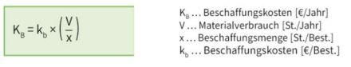
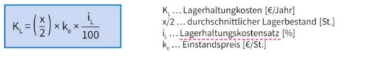
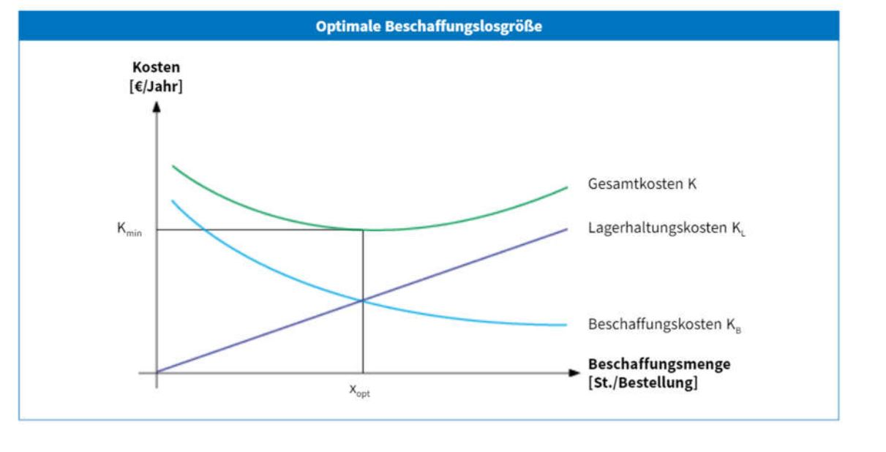
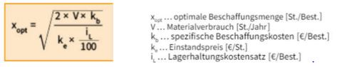
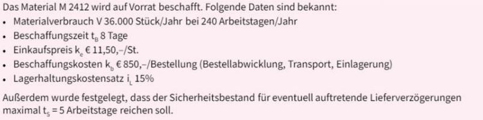
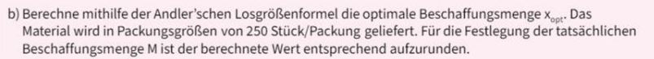

Optimale Bestellmenge
====

Was ist die optimale Bestellmenge?
----

- Materialmenge welche bei einem Beschaffungsvorgang bestellt wird nennt man Bestellmenge
- Es gibt 2 Faktoren zu berücksichtigen: 
   - Lagererhaltungskosten
   - Beschaffungskosten 
- Kann man in einem Diagramm auslesen oder Rechnerisch ermitteln.

Beschaffungskosten KB
----

- Bestehen aus Personalkosten für Bestellung und Trabsportkosten
- Fallen bei jeder Beschaffung in nahezu gleiche Höhe an
- Größere Beschaffungsmenge -> weniger Bestellungen -> niedrigere Beschaffungskosten



Lagerhaltungskosten KL
----

- Kosten des Materiallagers
- Sind abhängig von Menge und Wert des eingelagerten Materials
- Größere Beschaffungsmenge -> mehr Material wird eingelagert -> höhere Lagerhaltungskosten



Gesamtkosten K
----

- Summe aus Beschaffungskosten und Lagerhaltungskosten
- Minimum der Gesamtkosten -> optimale Bestellmenge

```
K = KL + KB
```

Optimale Bestellmenge mit Diagramm
----



Andler‘sche Losgrößenformel
----

- Dient zum ermitteln der optimalen Bestellmenge
- Liegt vereinfachte Annahmen zugrunde:
   - Konstanter Einstandspreis
   - Keine Berücksichtigung des Sicherheitsbestands
   - Beschaffungskosten unabhängig von der Bestellmenge



Beispiel für die Andler‘sche Losgrößenformel
----




