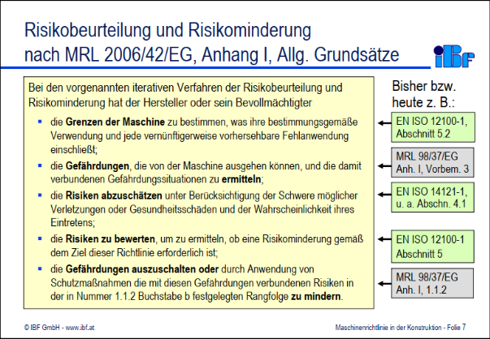
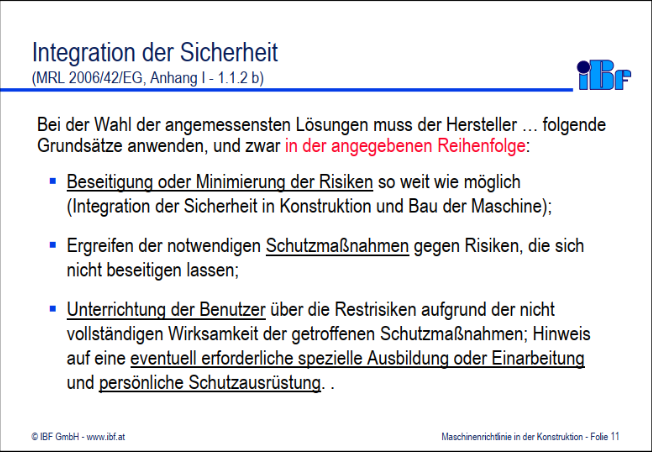
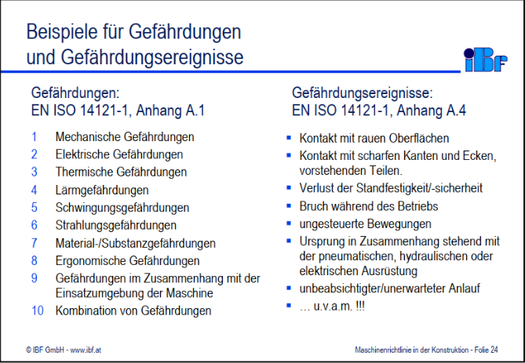
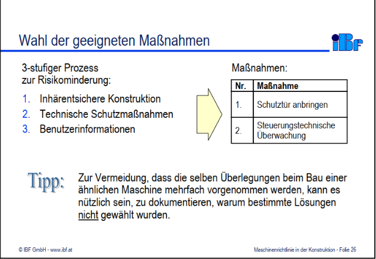
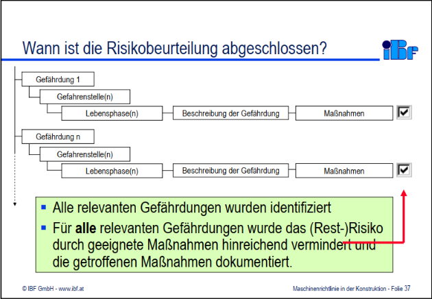
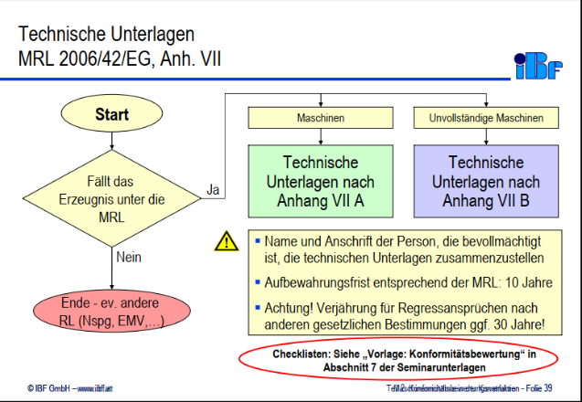

1 CE-Zertifizierung
====

---

#### CE-Zertifizierung

##### Sie sind GF eines Unternehmes, welches ... produziert. Ihre Wirtschaftsingenieure haben einen Vorschlag, wie man mit einer selbst gefertigten Anlage einen Fertigungsschritt vereinfachen kann und damit Qualitätsverbessern und Fertigungszeit vermindern kann. Worauf müsen Sie als GF bei der Anlage achten?

---

Aufbau
---

- Allgemeines
- Wer ist für die CE-Kennzeichnung verantwortlich?
- Entwicklung und Funktion
- Ziele dieser Zertifizierung
- Beispiel einer Mschinenzertifizierung
- Wichtige Merkamle der CE-Kennzeichnung
- Anbringen der CE-Kennzeichen an Maschinen
- Geltungsgebiet

Allgemeines
----

- Besagt, dass Normen eingehalten wurden
- Ist **kein Gütesiegel**

Entwicklung und Funktion
----

- Früher musste ein Produkt für jedes Land geprüft werden, ob es gerecht ist für alle Normen und Richtlinien
- Heute wird einmal geprüft auf dem Niveau von CE und danach darf in allen Ländern, in denen dies gilt, das Produkt ausgeliefert und verkauft werden.
- Ziel: frreier Warenverkehr und sichere Produkte innerhalb EWR
- "Reisepass" im europäischen Binnenmarkt
- Sicherheits- und Gesundheitsanforderungen als Mindestmaß dürfen keinesfalls unterschritten werden

Ziel der Zertifizierung
----

- Einheitliche Kennzeichnung von Produkten
- Beseitigung von Handelshemmnissen innerhalb der EU
- Einheitliche Bestimmungen duch Gemeinschaftsregelung
- Reduktion von Prüfkosten
- Gegenseitige Anerkennung von Prüfzertifikaten

Wer ist für die CE-Kennzeichnung verantwortlich?
----

- Grundsätzlich der Hersteller
- Niederspannungsrichtlinie
- Manchmal der Erstimporteur n den europäischen Raum
- Hersteller muss nicht im EU-Raum ansässig sein
- MRA: Mutual Recognition Agreements
   - Für Abkommen zwischen zB Kanada und Europa

---

Fragen und Antworten
----

- Mit was muss der Hersteller rechnen, wenn die CE-Kennzeichnung nicht erfüllt wird
   - Risikoanalyse, technische Unterlagen und Konformitätsprüfung sind zuerst zu übergeben
      - Sollte man diese nicht vorzeigen können, so ist es möglich, dass man alles verliert, von Firma bis hin zu eigenem Haus, aufgrund vom Schadensersatz
- Gibt es jemanden, der die Richtlinien überprüft?
   - An sich nicht, aber es gibt das Arbeitsinspektorat
      - Dieses überprüft regelmäßig, ob Unterlagen existieren, wie Konformitätsprüfung, technische Unterlagen und Risikoanalyse
	  - Es wird im ersten Schritt nur überprüft, ob diese Unterlagen überhaupt existieren
	  - Im zweiten Schritt kann überprüft werden - muss nicht immer sofort sein - ob alle Richtlinien eingehalten wurden.

---

Es gibt eigene Richtlinien für Spielzeuge innerhalb der EU

Mithilfe der Normen kann dies überprüft werden, ob diese Richtlinien eingehalten werden

---

Maschinenrichtlinien

Bilder

  
  
  
  
  
  
  
  
  
  
  

Text

- Risikobeurteilung und Risikominderung
   - Bei den vorgenannten iterativen Verfahren der Risikobeurteilung und Risikominderung hat der Hersteller oder sein Bevollmächtigter
      - die **Grenzen der Maschine** zu bestimmen, was ihre bestimmungsmäßige Verwendung und jede vernünftigungerweise vorhersehbare Fehlanwednung einschließt;
	  - die **Gefährdung**, die von der Maschine ausgehen können, und die damit verbundenen Gefährdungssituation zu **ermitteln**;
	  - die **Risiken abzuschätzen** unter Berücksichtigung der Schwere möglicher Verletzungen oder Gesundheitsschäden und der Wahrscheinlichekti ihres Eintretens;
	  - die **Risiken zu bewerten**, um zu ermitteln, ob ene Risikominderung gemäß dem Ziel dieser Richtlinie erforderlich ist;
	  - die **Gefährdungen auszuschalten oder** durch Anwednung von Schutzmaßnahmen die mit diesen Gefährdungen verbundenen Risiken in der in Nummer 1.1.2 Buchstabe b gestgelegte Rangfolge **zu mindern**
- Schritt üfr Schritt zur rechtskonformen Maschine
   1. Einstufung des Erzeugnisses
   2. Anwendung weiterer Richtlinien klären
   3. Freiwillige Anwednung von Normen klären
   4. Risikobeurteilung durchführen
      - Schwerpunkt in diesem Kapitel / Seminar
   5. Technische Unterlagen zusammenstellen
      - beinhaltet die Betriebs- bzw. Mintageanleitung
   6. Verfahren für Erzeugnis nach Anhang IV klären
   7. Interne Fertigungskontrolle
   8. CE-Kennzeichnung anbringen und Konformitätserklärung ausstellen
- Integration der Sicherheit
   - Bei der Wahl der angemessensten Lösungen muss der Hersteller ... fogende Grundsätze anwenden und zwar **in der angegebenen Reihenfolge**
      - <u>Beseitigung oder Minimerung der Risiken</u> so weit wie möglich (Integration der Sicherheit in Konstruktion und Bau der Maschine);
	  - Ergreifen der notwendigen <u>Schutzmaßnahmen</u> gegen Risiken, die sich nicht ebseitigen lassen;
	  - <u>Unterrichtung der Benutzer</u> über die Restrisiken augrund der ncht vollständigen Wirksamkeit der getroffenen Schutzmaßnahmen; Hinweis auf eine <u>eventuell erforderliche spezielle Ausbildung oder Einarbeitung</u> und <u>persönliche Schutzausrüstung</u>.
- Bsp Schutztür anbringen
   - Risikobewertung vor dem Anbringen der Schutztür
   - Festlegung der mechanischen Festigkeit der Schutztür
   - Art der Befestigung an der Maschine
   - Auswahl steuerungstechnischen Schutzeinrichtung
   - Auswahl des/der Endschalter/s und Art der Anbringung an der Maschine
   - Integration der Schutzeinrichtung in die Stuerung
- Festlegung der Grenzen der Maschine
   - Die Konstruktion der Maschine **beginnt** mit der Festlegung ihrer Grenzen:
      - **Verwendungsgrenzen:**
	     - bestimmungsgemäße Verwendung der Maschine einschließlich der verschiedenen Betriebsarten, Verwendungsphasen und unterschiedlichen Eingriffsmöglichkeiten für die Bedienpersonen;
		 - vernünfitgerweise vorhersehbare Fehlanwednung der Maschine;
	  - **räumliche Grenzen**
	     - zB Bewegungsraum, Platzbedarf für die Installation und Instandhaltung der Maschine, Schnittstellen "Mensch/Maschine" und "Maschine/Energieversorgung"
	  - **zeitliche Grenzen**
	     - verhersehbare "Lebensdauer" der Maschine und/oder einiger Teile (zB Werkzeuge, Verschleißteile, elektrische Baiteile) unter Berücksichtigung ihrer bestimmungsgemäßen Verwendung
- Beispiele für Gefährdungen und Gefährdungsereignisse

| Gefährdungen | Gefährdungsereignisse |
|:--- |:--- |
| Mechanische Gefährdungen | Kontakt mit rauen Oberflächen |
| Elektrische Gefährdungen | Kontakt mit scharfen Kanten und Ecken, vortehenden Teilen. |
| Thermische Gefährdungen | Verlust der Standfestigkeit/-sicherheit |
| Lärmgefährdungen | Bruch während des Betriebs |
| Schwingungsgefährdungen | ungeseteuerte Bewegungen |
| Strahlungsgefährdungen | Ursprung in Zusammenhang stehend mit der pneumatischen, hydraulischen oder elektrischen Ausrüstung |
| Material-/Substanzgefährdungen | unbeabsichtigter/unerwarteter Nalauf |
| Ergonomische Gefährdungen | ... u.v.a.m.!!! |
| Gefährdungen im Zusammenhang mit der Einsatzumgebung der Maschine |   |
| Kombination von Gefährdungen |   |

- Wahl der geeigneten Maßnahmen
   - 3-stufiger Prozess zur Risikominderung
      1. Inhärentsichere Konstruktion
      2. Technische Schutzmaßnahmen
      3. Benutzerinformation
   - Maßnahmen
      1. Schutztür anbringen
	  2. Steuerungstechnische Überwachung
- Wann ist die Risikobeurteilung abgeschlossen?
   - Alle relevanten Gefährdungen wurden identifiziert
   - Für **alle** relevanten Gefährdungen wurde das (Rest-)Risko durch geeignete Maßnahmen hinreichend vermindert und die getroffenen Maßnahmen dokumentiert.

