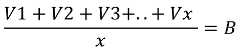
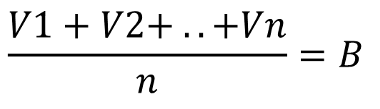
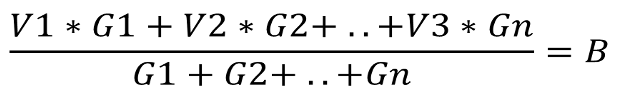
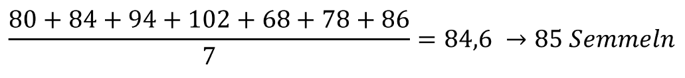
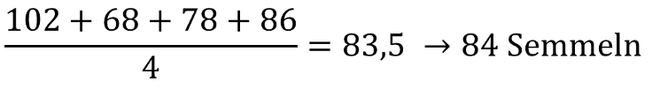
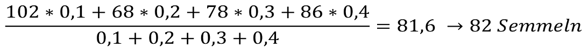
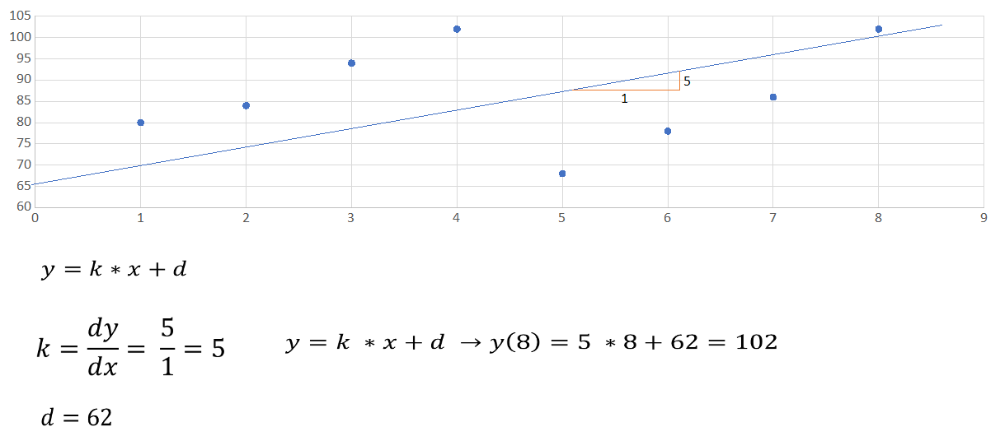

Materialbedarfsplanung
====

Materialbedarf
----

- Materialbedarf für das festgelegte Produktionsprogramm zu ermitteln
- Beinhaltet Eigenfertigungsteile, Rohstoffe, Zukaufteile als auch Hilfs- und Betriebsstoffe
- Unterschied zwischen: Primär-, Sekundär-, Tertiär-, sowie Brutto- und Nettobedarf

Primärbedarf
----

- Entspricht dem Produktionsprogramm
- Beinhaltet Produkte, die vom Unternehmen in der Periode hergestellt werden sollen

Sekundärbedarf
----

- Bedarf an Eigenfertigungsteilen, Rohstoffen und Zukaufteilen
- Wird aus dem Primärbedarf abgeleitet

Tertiärbedarf
----

- Bedarf an Hilfs- und Betriebsstoffen (z.B.: Schmiermittel, Schweißzusatzstoffe)
- Wird aus der Grundlage von vergangenen Verbrauchswerten ermittelt

Bruttobedarf
----

- Lässt sich aus dem Sekundär- bzw. Tertiärbedarf ermitteln
- Berücksichtigt Zusatzbedarf (Verschnitt, Ausschuss,…)

> Sekundärbedarf bzw. Tertiärbedarf + Zusatzbedarf = Bruttobedarf

Nettobedarf
----

- Berücksichtigt den verfügbaren Lagerbestand

> Bruttobedarf - Lagerbestand = Nettobedarf

Methoden der Materialbedarfsplanung
----

- Stücklistenauflösung
- Bedarfsprognosen
   - Arithmetische Mittelwert
   - Gleitender Mittelwert
   - Gewichteter gleitender Mittelwert
   - Lineare Regression
- Subjektive Bedarfsschätzung

Stücklistenauflösung
----

- Primärbedarf wird mit der Mengenangabe des jeweiligen Produkts multipliziert
- Ermittlung des Sekundärbedarf von Eigenfertigungsteilen, Rohstoffen und Zukaufteilen
- Primärbedarf * Menge laut Stückliste = Sekundärbedarf
- Nicht für Hilfs- und Betriebsstoffe anwendbar, da diese nicht in der Stückliste angeführt sind

Beispiel für eine Stücklistenauflösung
----

<table>
    <tr>
        <td><strong>Produkt P1</strong></td>
    </tr>
    <tr>
        <td><strong>Teil</strong></td>
        <td><strong>Menge</strong></td>
    </tr>
    <tr>
        <td>K1</td>
        <td>3 Stück</td>
    </tr>
    <tr>
        <td>K2</td>
        <td>2 Stück</td>
    </tr>
    <tr>
        <td>K3</td>
        <td>5 Stück</td>
    </tr>
    <tr>
        <td>T1</td>
        <td>1 Stück</td>
    </tr>
    <tr>
        <td>T2</td>
        <td>2 Stück</td>
    </tr>
</table>

<table>
    <tr><td><strong>Teil T1</strong></td></tr>
    <tr>
        <td>R1</td>
        <td>0,6m²</td>
    </tr>
    <tr>
        <td>R2</td>
        <td>1,4m²</td>
    </tr>
</table>
<table>
    <tr><td><strong>Teil T2</strong></td></tr>
    <tr>
        <td>R3</td>
        <td>0,9m²</td>
    </tr>
</table>
<table>
    <tr><td><strong>Produkt P1</strong></td></tr>
    <tr>
        <td><strong>Teil</strong></td>
        <td><strong>Menge</strong></td>
    </tr>
    <tr>
        <td>K1</td>
        <td>3 Stück</td>
    </tr>
    <tr>
        <td>K2</td>
        <td>2 Stück</td>
    </tr>
    <tr>
        <td>T1</td>
        <td>1 Stück</td>
    </tr>
</table>
<table>
    <tr><td><strong>Teil T1</strong></td></tr>
    <tr>
        <td><strong>Teil</strong></td>
        <td><strong>Menge</strong></td>
    </tr>
    <tr>
        <td>R1</td>
        <td>0,6m²</td>
    </tr>
    <tr>
        <td>R2</td>
        <td>1,4m²</td>
    </tr>
</table>

Es sollen 50 Stück des Produktes P1 hergestellt werden

| Produkt P1 |         | 50 Stück  |
|:---------- |:------- |:--------- |
| K1         | 3 Stück | 150 Stück |
| K2         | 2 Stück | 100 Stück |
| T1         | 1 Stück | 50 Stück  |
| R1         | 0,6m²   | 30m²      |
| R2         | 1,4m²   | 70m²      |

Beispiel: Ermittlung des Brutto- und Nettobedarfs
----

Es wird ein Zusatzbedarf von 10% angenommen und der verfügbare Lagerbestand sieht wie folgt aus: \
K1 -> 34 Stück, K2 -> 15 Stück, R1 -> 45m2 , R2 -> 10m2

|     | K1 | K2 | T1 | R1 | R2 |
|:--- |:--- |:--- |:--- |:--- |:--- |
| Sekundärbedarf | 150 Stück | 100 Stück | 50 Stück | 30m² | 70m² |
| + Zusatzbedarf (10%) | 15 Stück | 10 Stück | 5 Stück | 3m² | 7m² |
| = Bruttobedarf | 165 Stück | 110 Stück | 55 Stück | 33m² | 37m² |
| - Verfügbarer Lagerbestand | 34 Stück | 15 Stück | 0 Stück | 45m² | 10m² |
| --- | --- | --- | --- | --- | --- |
| = Nettobedarf | 131 Stück | 95 Stück | 55 Stück | 0m² | 27m² |

Bedarfsprognosen
----

- Mathematisch-statistische Methoden von ausgehen von vergangenen Verbrauchswerten
- Wird bei Hilfs- und Betriebsstoffen angewendet

Arithmetischer Mittelwert
----

- Mittelwert der vergangen Verbräuche wird berechnet und dieser Wert als Prognosewert für die nächste Periode herangezogen



```
Vx … Verbrauch in Periode x
x … Anzahl Perioden
B … Bedarfsprognose
```

Gleitender Mittelwert
----

-Bestimmte Anzahl an Perioden herangezogen



```
Vn … Verbrauch in Periode n
n … Anzahl der betrachtenden Perioden
B … Bedarfsprognose
```

Gewichteter gleitender Mittelwert
----

- Verbräuche der einzelnen Perioden gewichtet, die kürzer zurückliegenden Perioden haben ein höherer Gewicht



```
Vn … Verbrauch in Periode n
n … Anzahl der betrachtenden Perioden
B … Bedarfsprognose
Gn … Gewichtung der Periode n
```

Lineare Regression
----

- Bei einem ungefähr linear verlaufendem Trend anwendbar
- Bedarf wird mithilfe der allgemeinen Geradengleichung prognostiziert

```
y = k * x + d
```

Subjektive Bedarfsschätzung
----

- Wird angewendet, wenn die Ermittlung mittels Stücklistenauflösung oder Bedarfsprognose nicht möglich bzw. wirtschaftlich nicht sinnvoll ist
- Bedarf wird mittels subjektiver Bedarfsschätzung aus Basis von Erfahrungswerten festgelegt

Beispiel für eine Bedarfsprognose
----

Ein Bäcker verkauft Semmeln. Der Semmelverbrauch der letzten 7 Tage hat folgende Tabelle ergeben: 

| Tag               |  1  |  2  |  3  |  4  |  5  |  6  |  7  |
|:-----------------:|:---:|:---:|:---:|:---:|:---:|:---:|:---:|
| Verbrauch (Stück) | 80  | 84  | 94  | 102 | 68  | 78  | 86  |

*F: Wie viele Semmeln sollte er für den 8. Tag vorbereiten*

Methode 1: arithmetischer Mittelwert
----




Methode 2: gleitender Mittelwert
----

Gleitender Mittelwert auf Basis der letzten 4 Tage




Methode 3: gewichteter gleitender Mittelwert
----

Gewichteter gleitender Mittelwert auf Basis der letzten 4 Tage mit folgender Gewichtung: G1 = 10%, G2 = 20%, G3=30%, G4=40%




Methode 4: lineare Regression
----


