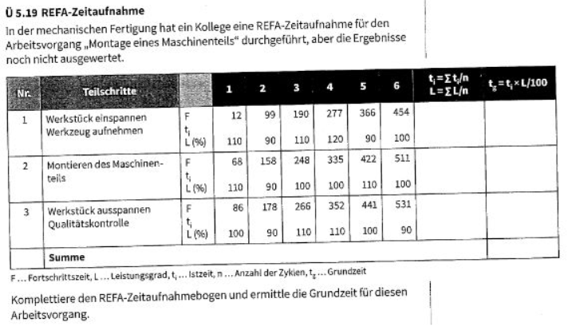
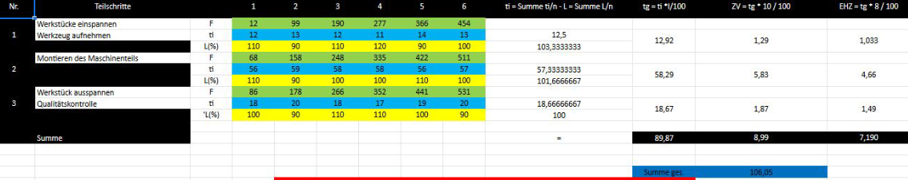

REFA / MTM
====

REFA
----

#### Zeitermittlung nach REFA:

Eine wesentliche Aufgabe der Arbeitsplanung ist die Ermittlung entsprechen der Vorgabezeiten für die im Arbeitsplan festgelegten 
Arbeitsvorgänge. Die ermittelten Zeiten dienen als Grundlage für die:

- Kalkulation der Herstellkosten des Produkts,
- Termin- und Kapazitätsplanung im Rahmen der Produktionsplanung,
- Entlohnung der Mitarbeiter bei Anwendung von Akkordlöhnen. 

Methods Time Measurements
----

Das “Systeme der vorbestimmter Zeiten".  Grundlegend zerlegt in:

- Analyse der Bewegungsabläufe
- Bestimmen der Einflussgrößen
- Grundbewegung bestimmen
- Summe aller Grundbewegungszeiten rechnen

#### Beispiel MTM

Für das Montieren eines Bolzens (⌀ 8 x 12 mm) an einem Gehäuse soll die Grundzeit mithilfe des MTM-Verfahrens ermittelt werden. Der Bolzen muss zu diesem Zweck aus einem Behälter entnommen, zu einem Bohrloch bewegt und mit leichtem Druck in das Bohrloch geschoben werden.

Die Bolzen liegen vermischt in einem Behälter. Der Abstand zwischen Behälter und Bohrloch am Gehäuse beträgt 40 cm.

**Lösung:**

| Grundbewegung | Einflussfaktoren | MTM-Code | Zeit |
|:------------- |:---------------- |:-------- | ----:|
| Hinlangen     | Bewegungslänge: 40cm; Bolzen liegt vermischt mit anderen | R 40 C | 16,8 TMU |
| Greifen       | Abmessungen des Bolzens ⌀8x12mm; Bolzen liegt vermischt mit anderen | G 4 B | 9,1 TMU |
| Bringen       | Bewegunglänge: 40cm; Platziergenauigkeit: genau | M 40 C | 18,5 TMU |
| Fügen         | Passung: eng (leichter Druck notwendig); Symmetrie: vollsymmetrisch | P 2 SE | 16,2 TMU |
| Loslassen     | Öffnen der Finger | RL1 | 2,0 TMU |
| **Gesamt**    |     | (1 TMU = 0,036s) | **62,6 TMU = 2,25s** |

#### Extra Bsp

Ein Stahlbauunternehmen ist auf de Lieferung und Montage von Stahlbaukonstruktionen im Industrieanlagenbau spezialisiert. Die Ermittlung der voraussichtlich benötigten Zeiten für die Fertigung und Montage erfolgt dabe mittels Planzeitkatalogen. Hier siehst du einen Auszug aus einem der Planzeitkataloge für die Ermittlung von Montagezeiten:

<table>
	<td>
		<tr><strong>Planzeitkatalog für Montagetätigkeiten</strong></tr>
	</td>
	<td>
		<tr>schwerer Stahlbau (Hauptträger und -pfosten)</tr>
		<tr>15</tr>
		<tr>h/t</tr>
	</td>
	<td>
		<tr>leichter Stahlbau (Verstrebungen)</tr>
		<tr>30</tr>
		<tr>h/t</tr>
	</td>
	<td>
		<tr>Fassadenverkleidung (Wand, Dach)</tr>
		<tr>1,2</tr>
		<tr>h/m²</tr>
	</td>
	
	<td>
		<tr><strong>Rohrleitungen inkl. Aufhängung und Armaturen</strong></tr>
	</td>
	<td>
		<tr>Nennweite 8 bis 15 mm</tr>
		<tr>2,4</tr>
		<tr>h/m</tr>
	</td>
	<td>
		<tr>Nennweite 20 bis 32 mm</tr>
		<tr>4,4</tr>
		<tr>h/m</tr>
	</td>
	<td>
		<tr>Nennweite 40 bis 100 mm</tr>
		<tr>7,5</tr>
		<tr>h/m</tr>
	</td>
	
	<td>
		<tr><strong>Bühnen und Treppen</strong></tr>
	</td>
	<td>
		<tr>Stahlbau</tr>
		<tr>45</tr>
		<tr>h/t</tr>
	</td>
	<td>
		<tr>Lichtgitter</tr>
		<tr>1,5</tr>
		<tr>h/m²</tr>
	</td>
</table>
