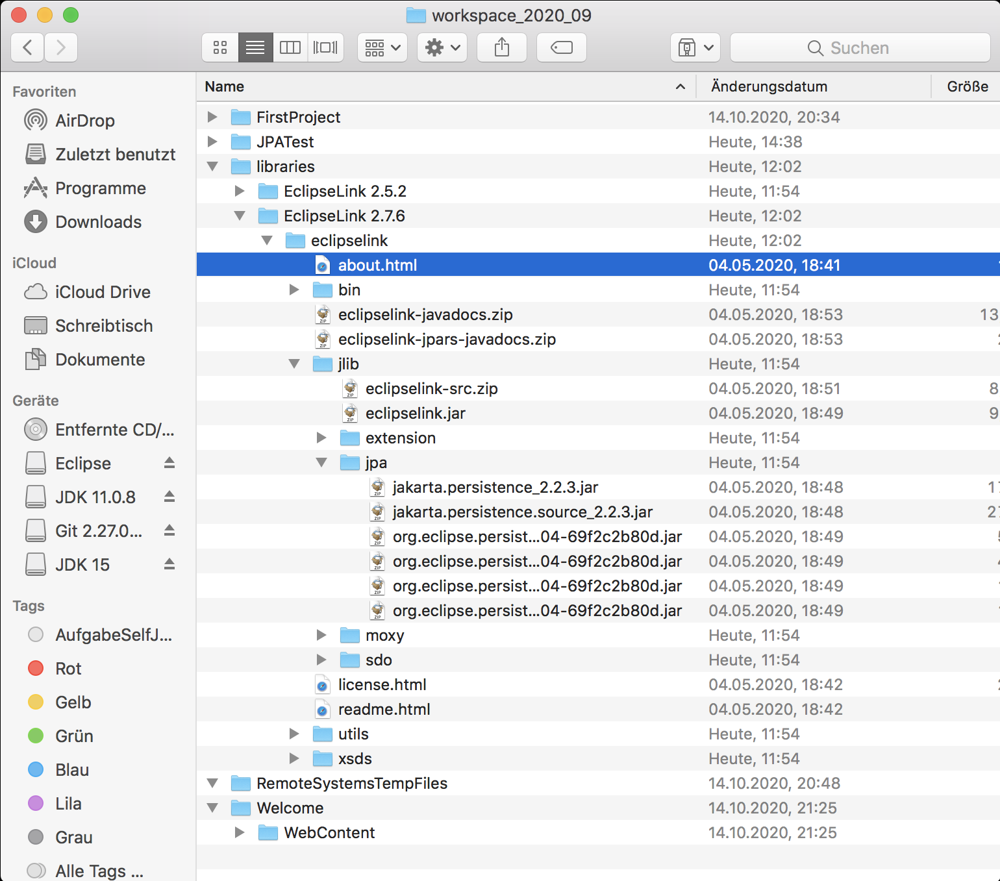
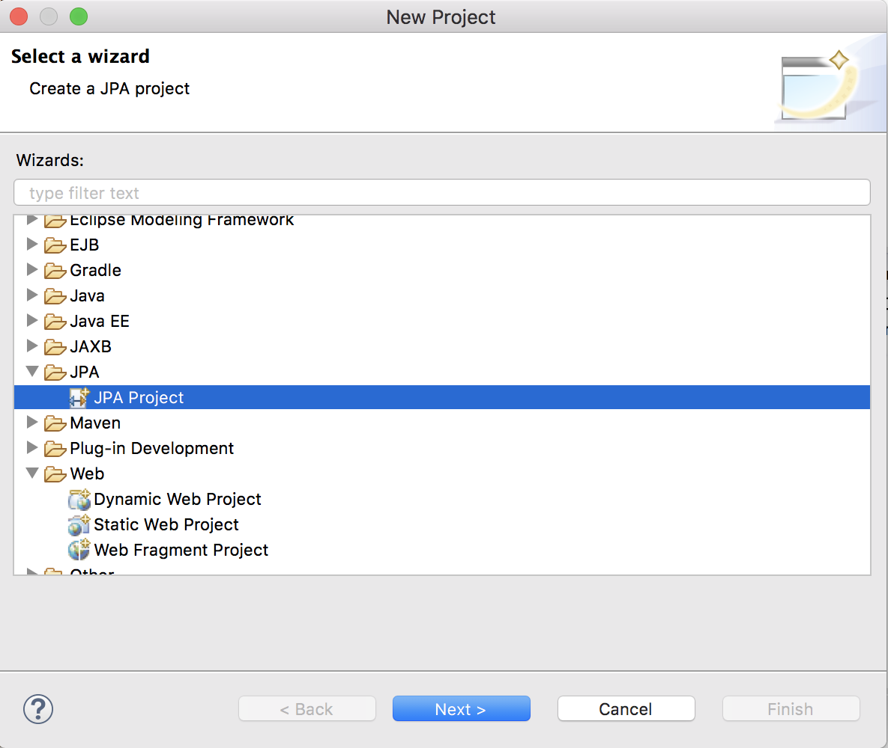

ORM – JPA Konfiguration
====

Projekt in Eclipse anlegen
----

##### JPA Installation Voraussetzungen

- Eclipse Installation 2020-09, Java EE Edition
   - https://www.eclipse.org/downloads/packages/release/2020-09/r/eclipse-ide-enterprise-java-developersJava EE Edition
- Java SE 15 (JDK Version 15)
   - https://www.oracle.com/java/technologies/javase-jdk15-downloads.html
   - In einem Sample Projekt noch die JRE manuell übernehmen, damit sie dann in der JPA Konfiguration verfügbar ist
   - Compiler Level auf 14 stelle.
- MySql Java Connector Download, Version: mysql-connector-java-8.0.21
   - https://dev.mysql.com/downloads/connector/j/?os=26
- EclipseLink Version 2.7.6 Download
   - https://www.eclipse.org/downloads/download.php?file=/rt/eclipselink/releases/2.7.6/eclipselink-2.7.6.v20200131-b7c997804f.zip
   
   

- Ablage im Workspace unter 
   - Libraries
      - EclipseLink 2.7.6
         - eclipselink
- MySQL Datenbank Schema anlegen
   - mydb

JPA Project Konfiguration
----

- Im Eclipse Workspace
   - New Project -> JPA-> JPA Projekt 
   - Projektname = JPATest

- Projektname festlegen
   - JPATest

----

So ein Stuhl.

I mach a Repo für des Zeug in IntelliJ statt in Eclipse, weil jeder IntelliJ und ned Eclipse verwendet.

----
