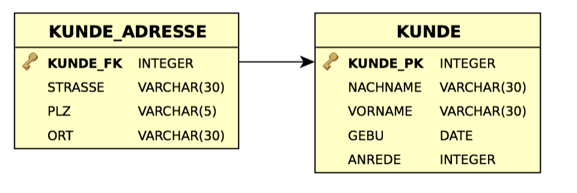

ORM - JPA - Mehrere Tabellen für ein Entity
====

Mehrere Tabellen für ein Entity
----

- JPA erlaubt ein feinkörniges Objektmodell zu realisieren.
- Darunter versteht man die Möglichkeit, mehr Klassen als Tabellen zu haben, um so dem objektorientierten Ziel kleinere Klassen näher zu kommen.
- In der Praxis ist auch der umgekehrte Fall anzutreffen wo zum Beispiel bereits eine Datenbank (Legacy engl. Für Altlast, Erbe, Vermächtnis) existiert, bei der zwei Tabellen realisiert sind.
- Ziel ist es, ein Entity ``Kunde`` zu entwerfen, das seine Daten in den bereits bestehenden Tabellen verwaltet bzw. von JPA verwalten lässt. 


- JPA sieht dafür die ``@Secondary-Table``-Annotation vor.

| **Attribut** | **Typ** | **Default** | **Beschreibung** |
|:------------ |:------- |:----------- |:---------------- |
| name | String | -- | Name der Tabelle |
| catalog | String | Default Katalog | Der Katalog der Tabelle |
| pkJoinColumns | PrimaryKey-CjoinColumn[] | {} | Spalte(n) für Join mit der Primärtabelle. Default sind PK-Spalten der Primärtabelle. |
| schema | String | Default-Schema | Das Schema der Tabelle |
| uniqueConstraints | boolean | True | Spaltenname(n) für Uniqe-Constraints |

```JAVA
@Entity
@SecondaryTable (name = "KUNDE_ADRESSE", 
 pkJoinColumns = {@PrimaryKeyJoinColumn(name = "KUNDE_FK")})
public class Kunde {
	@Id @GeneratedValue
	@Column(name = "KUNDE_PK")
	private Integer Id;
	@Column(length = 30)
	private String Vorname;
	@Column(length = 30)
	private String Nachname;
	@Temporal(TemporalType.DATE) @Column(name = "GEBU")
	private Date Geburtsdatum;
	private Anrede Anrede;
	
	@Column(table = "KUNDE_ADRESSE", length = 30)
	private String Strasse;
	@Column(table = "KUNDE_ADRESSE", length = 5)
	private String Plz;
	@Column(table = "KUNDE_ADRESSE", length = 30)
	private String Ort;
	. . .
```

- ``@SecondaryTable`` definiert den Namen der Sekundärtabelle
   - Mit dem zwingenden ``name``-Attribute
   - Attribut ``pkJoinColumns`` definert den Fremdschlüssel in der Primärtabelle
   - Bei zusammengesetzten Schlüssel sind hier mehrere Spalten anzugeben
- ``@Column`` Annotation für abweichende Property Zuordnung.
- Ein Entity kann mehrere Sekundärtabellen haben. Diese werden über die ``@SecondaryTable``-Annotation angegeben, die eine Liste von ``@SecondaryTable``-Annotation erwartet.
```JAVA
@Entity
@SecondaryTable ({
	@SecondaryTable (
		name = "TABELLE_1", 
		pkJoinColumns = {@PrimaryKeyJoinColumn(name = "FK_1")}),
	@SecondaryTable (
		name = "TABELLE_2", 
		pkJoinColumns = {@PrimaryKeyJoinColumn(name = "FK_2")}),
	@SecondaryTable (
		name = "TABELLE_3", 
		pkJoinColumns = {@PrimaryKeyJoinColumn(name = "FK_3")})
})

pubic class EntityMitMehrerenTabellen {
	. . .
```