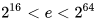

Kryptographie
====

Wissenschaft der Verschlüsselung von Informationen.


Dies gilt immer:
----

Es sendet (zum Erklären) immer **Alice** an **Bob**
Der Man-in-the-middle heißt (zum Erklären) immer **Eve**

Geschichte
----

- Ägypter dachten sich schon Zeichen aus, die bis heute nicht (Stand 2021) komplett entschlüsselt werden konnten
- Cäsar
- Enigma
- ...

Kerckhoff\'sche Prinzip
----

Die Sicherheit eines Verschlüsselungsverfahrens beruht auf der Geheimhaltung des Schlüssels, anstatt der Geheimhaltung des Verfahrens.

Symmetrische Verschlüsselung
====

<table>
<tbody>
<tr>
<td style="text-align: center;">Schlüssel</td>
<td style="text-align: center;">➡➡ ➡➡</td>
<td style="text-align: center;">Geheimtext</td>
</tr>
<tr>
<td style="text-align: center;">⬆⬆ ⬆⬆</td>
<td style="text-align: center;"></td>
<td style="text-align: center;">⬇⬇ ⬇⬇</td>
</tr>
<tr>
<td style="text-align: center;">Klartext</td>
<td style="text-align: center;">⬅⬅ ⬅⬅</td>
<td style="text-align: center;">Schlüssel</td>
</tr>
</tbody>
</table>

Das Problem beim symmetrischen Verschlüsseln ist die Schlüsselübergabe. Es gibt aber Methoden, die auch dieses Problem beseitigen können (Diffie-Hellmann Schlüsselübertragung).


Cäsar Verschlüsselung
====

> "Mit der leichtesten fangen wir an..."

Alice will ``Hallo`` an Bob senden, aber Eve soll es nicht verstehen können.
Bei Cäsar-Verschlüsselung wird ein Buchstabe um ``N`` Buchstaben verschoben, bspw. 5 nach rechts. Daraus resultiert dann ``Mfqqt``.
Somit wird dann an Bob ``Mfqqt`` gesendet und Eve kann auch nur das verstehen.
Bob verschiebt dann die Buchstaben um 5 nach links.

Eingangstext: ``Hallo``
Schlüssel: ``5``
Geheimtext: ``Mfqqt``


Vor- und Nachteile
----

| Schwächen | Stärken |
|:--------- |:------- |
|  Kerckhoff\'sches Prinzip gilt nicht | einfach, schnell |
| Schlüsselübertragung | bereits verschlüsselte Inhalte werden wieder gleich verschlüsselt |


Enigma Verschlüsselung
====

Verschlüsselungsmaschine im zweiten Weltkrieg von den Nazis.
Basiert auf Cäsar: Der erste Schlüssel, war zB. das Datum und bei jeder Eingabe (bei jedem Tippen einer Taste) wurde weiter Verschlüsselt

Eingangstext: ``Hallo``
Schlüssel:
```
Rotornummer - Rotor - Position - Ring
1           - Beta  - 1A       - 1A
2           - I     - 17Q      - 1A
3           - III   - 12L      - 1A
4           - I     - 1A       - 1A

Steckerbrett
bq - cr - di - kw - mt - os - px - uz - gh
```
Geheimtext: ``xuft g``

[Online](https://cryptii.com/pipes/enigma-machine) verschlüsselt


Vor- und Nachteile
----

| Schwächen | Stärken |
|:--------- |:------- |
| Kerckhoff\'sches Prinzip gilt nicht | einfach, schnell |
| Schlüsselübertragung |  |


Vigenere
====

Der Eingangstext wird pro Stelle mit dem Schlüssel vverschlüsselt mithilfe des Prinzips von Cäsar.

Eingangstext: ``SCHULE``
Schlüssel: ``3624``
Geheimtext: ``VIJYOK``


Vor- und Nachteile
----

| Schwächen | Stärken |
|:--------- |:------- |
| Kerckhoff\'sches Prinzip gilt nicht | einfach, schnell |
| Schlüsselübertragung |  |


AES / DES
====

Ist eine sogenannte _Blockverschlüsselung_ und funktioniert auf binärer Ebene
Blockgröße: 128 Bit

> "Mia schauen uns des nid so genau an, weil da muas man Nullen und Einsen hin und her vertauschen und da vatuat man sich gerne"

Schlüssel: 128, 160, 192, 224 oder 256 Bit
Im Grunde gilt, wenn der Schlüssel länger ist, ist die Nachricht sicherer
Blöcke haben fixe Größe => Länge der Nachricht kann nicht erkannt werden bei solchen Verschlüsselungen


Verfahren
----

Aus dem Schlüssel werden Rundenschlüssel erzeugt
Für jede Runde wird ein Schlüssel berechnet, der aus dem originalen Schlüssel gebildet werden kann
Der Block und der (Runden-)Schlüssel werden für jede Runde mit einem binären ``XOR`` verbunden

#### Alice
##### Pro Runde:
1. Bytes werden getauscht
2. Zeilen werden verschoben
3. Spalten werden vertauscht
4. ``XOR`` verbindet aktuellen Block mit Rundenschlüssel

##### Bei Schlussrunde:
1. Bytes werden getauscht
3. Spalten werden vertauscht
4. ``XOR`` verbindet letzten Block mit Schlussrundenschlüssel

#### Bob
Er durchläuft den Algorhithmus genau umgekehrt zu Alice, hat aber den selben Schlüssel wie Alice


Vor- und Nachteile
----

| Schwächen | Stärken |
|:--------- |:------- |
| Schlüsselübertragung | schnell (für Computer) |
|  | Kerckhoff\'sches Prinzip erfüllt |


Anwendung
----

- SSH
- WLAN
- IPsec
- IP-Telefonie (ist nicht so etwas wie Skype)
- Skype (nutzt es aber trotzdem)
- ...


Asymmetrische Verschlüsselung
====

Ein Schlüssel zum Verschlüsseln - **Public Key**
Ein Schlüssel zum Entschlüsseln - **Private Key**

<table>
<tbody>
<tr>
<td style="text-align: center;">Public Key</td>
<td style="text-align: center;">➡➡ ➡➡</td>
<td style="text-align: center;">Geheimtext</td>
</tr>
<tr>
<td style="text-align: center;">⬆⬆ ⬆⬆</td>
<td style="text-align: center;"></td>
<td style="text-align: center;">⬇⬇ ⬇⬇</td>
</tr>
<tr>
<td style="text-align: center;">Klartext</td>
<td style="text-align: center;">⬅⬅ ⬅⬅</td>
<td style="text-align: center;">Private Key</td>
</tr>
</tbody>
</table>

RSA-Algorithmus
----

RSA sind die drei Entwickler des Algorithmus
Beispiel mit einfache Zahlen:

Alice -> Bob

Ablauf:
----

1. Bob
	2. Zwei Primzahlen
		- ca. gleich viele Stellen
		- nicht zu nah beieinander
			- zwei aufeinander folgende Primzahlen sind eine schlechte Idee
		- 19 und 23 für Erklärung.. keine gute Praxis!!!
		- In der Praxis liegen die Primzahlen im Bereich von 
		- ``N = p * q = 19 * 23 = 437``
	3. ``m = (p - 1) * (q - 1) = 18 * 22 = 396``
	4. Bob wählt eine weitere Zahl ``e`` mit folgenden Eigenschaften
		- teilerfremd zum ``ggT(m,e) = 1``
		- ``e = 59`` zur Erklärung
		- Public Key = ``59,437``
5. Alice
	- nimmt ``(a^e) % N = (97^59) % 437 = 203``
		- "%" entspricht dem "Modulo-Operator"
		- Das für jedes Zeichen
		- sendet den verschlüsselten Wert (203) an Bob
6. Bob
	- muss eine Gleichung lösen
	- ``e * d + k * m = 59 * s + k * 396 = 1``
	- EEA - erweiterter euklidischer Algorithmus
	- Hiermit werden ``d`` und ``k`` ermittelt. Interessant ist für Bob nur ``d``
	- ``d = 47; k = -7``
	- Private Key = ``47,437``
	- ``(203^47) % 437 = 97``