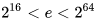

Inhaltsverzeichnis
====

1. [Asymmetrische Verschlüsselung](#asymmetrische-verschlüsselung)
2. [RSA](#rsa-algorithmus)
3. [Diffie-Hellmann]()

Asymmetrische Verschlüsselung
====

Ein Schlüssel zum Verschlüsseln - **Public Key**
Ein Schlüssel zum Entschlüsseln - **Private Key**

<table>
<tbody>
<tr>
<td style="text-align: center;">Public Key</td>
<td style="text-align: center;">➡➡ ➡➡</td>
<td style="text-align: center;">Geheimtext</td>
</tr>
<tr>
<td style="text-align: center;">⬆⬆ ⬆⬆</td>
<td style="text-align: center;"></td>
<td style="text-align: center;">⬇⬇ ⬇⬇</td>
</tr>
<tr>
<td style="text-align: center;">Klartext</td>
<td style="text-align: center;">⬅⬅ ⬅⬅</td>
<td style="text-align: center;">Private Key</td>
</tr>
</tbody>
</table>

RSA-Algorithmus
----

RSA sind die drei Entwickler des Algorithmus
Beispiel mit einfache Zahlen:

Alice -> Bob

Ablauf:
====

<ul>
    <li>1. Bob
        <ul>
            <li>1. Zwei Primzahlen
                <ul>
                    <li>ca. gleich viele Stellen</li>
                    <li>nicht zu nah beieinander
                        <ul>
                            <li>zwei aufeinander folgende Primzahlen sind eine schlechte Idee</li>
                        </ul>
                    </li>
                    <li>19 und 23 für Erklärung.. keine gute Praxis!!!</li>
                    <li>In der Praxis liegen die Primzahlen im Bereich von </li>
                    <li><code>N = p * q = 19 * 23 = 437</code></li>
                </ul>
            </li>
            <li>2. <code>m = (p - 1) * (q - 1) = 18 * 22 = 396</code></li>
            <li>3. Bob wählt eine weitere Zahl <code>e</code> mit folgenden Eigenschaften
                <ul>
                    <li>teilerfremd zum <code>ggT(m,e) = 1</code></li>
                    <li><code>e = 59</code> zur Erklärung</li>
                    <li>Public Key = <code>59,437</code></li>
                </ul>
            </li>
        </ul>
    </li>
    <li>4. Alice
        <ul>
            <li>4. nimmt <code>(a^e) % N = (97^59) % 437 = 203</code>
                <ul>
                    <li>&quot;%&quot; entspricht dem &quot;Modulo-Operator&quot;</li>
                    <li>Das für jedes Zeichen</li>
                    <li>sendet den verschlüsselten Wert (203) an Bob</li>
                </ul>
            </li>
        </ul>
    </li>
    <li>5. Bob
        <ul>
            <li>muss eine Gleichung lösen</li>
            <li><code>e * d + k * m = 59 * s + k * 396 = 1</code></li>
            <li>EEA - erweiterter euklidischer Algorithmus</li>
            <li>Hiermit werden <code>d</code> und <code>k</code> ermittelt. Interessant ist für Bob nur <code>d</code></li>
            <li><code>d = 47; k = -7</code></li>
            <li>Private Key = <code>47,437</code></li>
            <li><code>(203^47) % 437 = 97</code></li>
        </ul>
    </li>
</ul>

Sicherheit
====

Die Sicherheit besteht darin, die Primfaktoren herauszufinden.
Sind diese bekannt, kann die Verschlüsselung aufgehoben werden.
Es ist mathematisch ein schwieriges Problem eine Zahl in ihre Primfaktoren zu zerlegen.
Ca mehrere 100 Stellen

Vor- und Nachteile
----

| Schwächen | Stärken |
|:--------- |:------- |
| langsam | keine Probleme mit dem Schlüssel |
| bereits verschlüsselte Inhalte werden wieder gleich verschlüsselt | Kerckhoff\'sches Prinzip erfüllt |

### Lösung

Mehrere Verschlüsselungsverfahren kombinieren -> [Hybride Verschlüsselung](./Kryptographie_Hybrid.md)
Schlüssel asymmetrisch übertragen und Daten symmetrisch verschlüsseln

### Anwendung von RSA

- Digitale Signatur von RSA
    - Alice/Client mit Public Key
	- Bob/Server mit Private Key
	- Woher weiß Alice, dass sie wirklich mit Bob kommuniziert?
		- Alice schickt ein beliebiges Zeichen an Bob, bspw. ``124``
		- Bob verschlüsselt dieses Zeichen und sendet es zurück an Alice
		- Alice entschlüsselt die verschlüsselte Nachricht
			- Wenn daraus wieder das originale Zeichen (``124``) resultiert, kann Alice sich sicher sein, dass sie mit Bob kommuniziert
			- Wenn daraus etwas anderes resultiert, kommuniziert Alice soeben sehr wahrscheinlich nicht mit Bob, sondern mit jemand Fremden oder gar mit Eve

----

Wenn man auf eine Website geht und die Verbindung über HTTPS ( = verschlüsselt), werden auch Informationen von Zertifikaten übertragen, allerdings im Klartext. Das ist zwischen Layer 4 und Layer 5 im OSI-Modell.
Zertifikate dienen zur Überprüfung von der Vertrauenswürdigkeit von Webseiten. Sie gelten nur für bestimmte Zeiträume

Diffie-Hellmann Schlüsselaustausch
====

- Alice
	- Public Key von Bob
	- Private Key von Alice
	- Daraus resultiert ein Key
- Bob
	- Public Key von Alice
	- Private Key von Bob
	- Daraus resultiert der selbe Key wie der von Alice' resultierende

Das ist symmetrische Verschlüsselung

Es spielen wieder Primzahlen eine Rolle.
Ebenso sind diese wieder groß

Ablauf
----

Im Beispiel werden kleine Zahlen zum Verständnis verwendet

1. Zwei Zahlen
	- ``p = 17``
		- zufällig gewählt
	- ``y = 12``
		- muss bestimmte Kriterien erfüllen
	- Diese zwei Zahlen sind in der Praxis vorgegeben
2. Alice und Bob wählen Zahlen aus
	- Zahl muss kleiner sein als ``p``
		- Menge: ``{1, ..., p-1}``
	- Alice: ``a = 14``
	- Bob: ``b = 5``
	- Diese Zahlen sind die jeweiligen Private Keys
3. Alice und Bob berechnen die Public Keys
	- Alice: ``A = (y ^ a) % p`` -> ``15 = (12 ^ 14) % 17``
	- Bob: ``B = (y ^ b) % p`` -> ``3 = (12 ^ 5) % 17``
4. Public Keys austauschen
5. Überprüfen, ob die Schlüssel übereinstimmen
	- Alice hat eigenen Private Key ``a`` und Bob's Public Key ``B``
		- ``(B ^ a) % p`` -> ``(3 ^ 14) % 17 = 2``
	- Bob hat eigenen Private Key ``b`` und Alice' Public Key ``A``
		- ``(A ^ b) % p`` -> ``(15 ^ 5) % 17 = 2``
	- Gleichen sich die Ergebnisse, sind Alice und Bob sich sicher, dass sie miteinander kommunizieren
	- Andernfalls kommunizieren sie mit Fremden, wenn nicht mit Eve

Sicherheit
----

Es gibt keine Umkehroperation zum Modulo-Operator.
