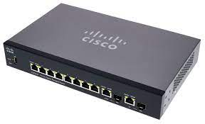
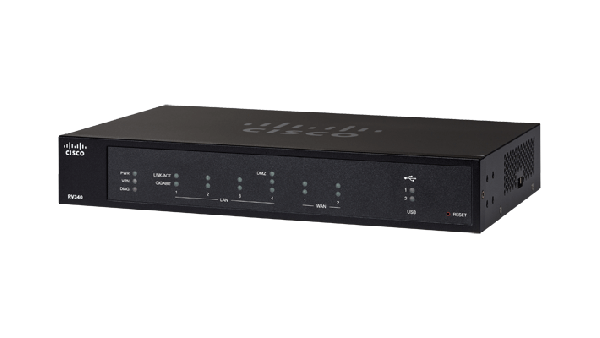

Übertragungsmedien Komponenten / Devices
====

### Devices/Komponenten & Übertragungsmedien

Devices/Komponenten
----

- Devices
   - Endgerät
   - Switch
   - Router
   - Hub
   - Access Point
   - …

Endgerät
----

- Jedes Gerät, welches an ein öffentliches bzw. privates Telekommunikations- bzw. Datennetz angeschlossen ist
- Damit ist Sprach- und Datenkommunikation zwischen Teilnehmern möglich
- Übertragung erfolgt mit optische Verbindungen(Kabel) oder Funk
- Handy, Tablet, Laptop, PC, SmartHome-Geräte, Kühlschrank

Switch
----

- Arbeitet auf Layer 2 des OSI-Modells (Layer-3 Switch auch auf Layer 3)
- Form: meistens Flacher Kasten, Netzwerkkabelanschlüssen
- Verbindet Geräte im lokalen Netz
- Kann gleichzeitig Daten senden und empfangen
- Switching (Tabelle, sendet -> Destination Mac, speichert SourceMac an Port)

Router
----

- Verbindet Netzwerke auf Layer 3 des OSI-Modells
- Leitet auf Basis der IP-Adresse Daten weiter
- Im privaten Umfeld: Heimnetz -> Internet

Hub
----

- Sieht ähnlich aus wie ein Switch (besitz mehrere Netzwerkkabelanschlüsse)
- Unterschied vom Switch
   - Beim erhalt eines Datenpaketes -> kopiert es an alle Ports
   - Fungiert also als gemeinsamer Verbindungspunkt für Geräte

Access Point
----

- Kleines Gerät, welches per Lan mit Router verbunden wird
   - In meisten Heimnetz-Routern integriert
- Es empfängt das eingehende Signal vom Router und verbreitet es im WLAN-Netzwerk, welches vom AP aufgebaut wird
- Mit Endgerät -> verbinden zu WLAN-Netzwerk möglich

Übertragungsmedien
----

- Kupfer
   - Twisted-Pair-Kabel
   - Koaxialkabel
- Lichtwellenleiter
   - Glasfaser
- Funk
   - Wireless Lan

Generelles
----

- Mit Übertragungsmedien sind Verbindungen gemeint, welche Komponenten verbinden (physisch)
- Gängige Methoden: Kupfer, Glasfaser, Funk

Kennzeichnung
----

- Es werden für heutige Übertragungsmedien im Kabelbereich standardisierte Kennzeichnungen verwendet
- Kennzeichnung: Übertragungsrate | Übertragungsart |Medium
- Bsp: Kupferkabel(Twisted Pair) 
   - 10 Base-T (10 Mbit/s |Basisbandsignalisierung Ethernet – Twisted-Pair)  

Twisted Pair
----

- Besteht aus 4 oder 8 Leitern
- Immer 2 Leiter miteinander verdrillt
   - Besseren Schutz gegen Störfelder
- 2 Arten: UTP und STP (wurde im Unterricht nicht genau besprochen)

Koaxialkabel
----

- Eignet sich gut, um hochfrequente, breitbändige Signale zu übertragen
- Ist im Heimnetz nicht oft im Gebrauch, wird im Bereich Radio und Fernsehen verwendet
- Besteht aus:
   - Inennleiter 
      - starrer Kupferleiter	
   - Dielektrikum
      - Isolationsschicht aus Kunststoff
   - Schirmung 
      - elektr.  leitende Ummantelung
         - Schützt Innenleiter vor elektromagnetischen Einflüssen	
   - Kabelmantel 
      - Äußerer Schutz eines Kabels

Glasfaser
----

- Besteht aus:
   - Kern
      - Lichtsignale transportiert
   - Mantel
      - Sorgt für die Führung der Lichtwellen-Signale
   - Außenmantel
      - Verschafft der Glasfaser aufgrund seiner Beschaffenheit aus Kunstsoff biegsame u. robuste Eigenschaften
- 2 Arten von Kernen
   - Single-Mode-Kern
      - Umfang von ca. 9 Mikrometer
      - Infrarotes Laserlicht
      - Nur ein Signal wird übertragen
      - Verwendung: Telefonleitung, Kabelfernseher
   - Multi-Mode-Kern
      - Umfang von ca. 62 Mikrometer
      - Licht einer LED
      - Mehrere Signale werden übertragen
      - Verwendung: Computernetze

Wireless Local Area Network (WLAN)
----

- Lokales Netzwerk, welches auf Funkbasis arbeitet. 
- Datenübertragung erfolgt Kabellos
- Übertragung erfolgt über Access Point
- Übertragungsgeschwindigkeit hängt von der Anzahl der Nutzer ab

Übersicht - Übertragungsmedien
----

| Eigenschaften | Kupfer | Glasfaser | Drahtlos |
|:--- |:--- |:--- |:--- |
| Distanz [m] | 100 | 100.000 | 100 |
| Bandbreite [Gbit/s] | 10 | 100 | 1 |
| Störungen (EMI, Crosstalk) | wenig | keine | viele |
| Kosten | mittel | teuer | billig |
| Installation | mittel | schwer | einfach |
