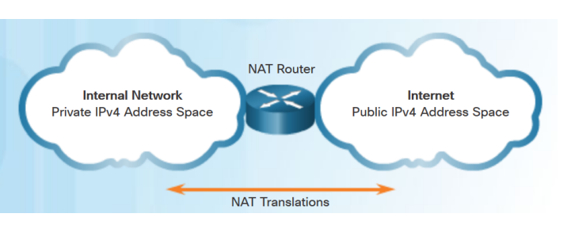
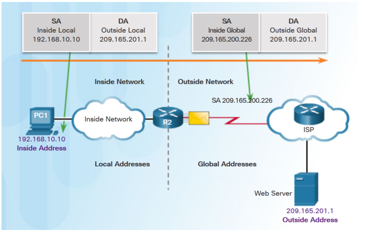
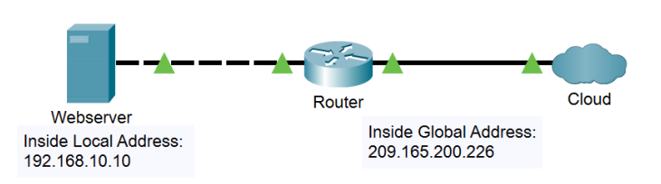
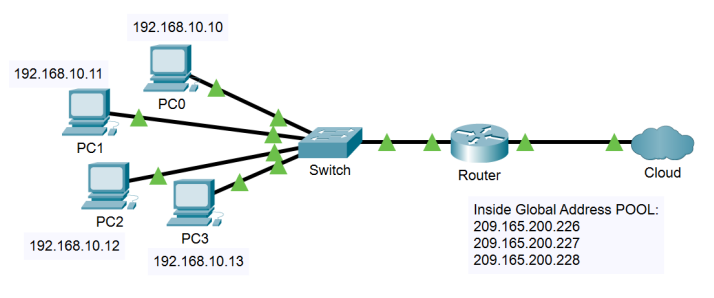

NAT / PAT
====

**Einführung**
----

Motivation
----

- Warum Nat?
- Nat (Network Address Translation) wird verwendet um IPv4-Adressen zu sparen
- Was macht Nat?
- Nat trennt die IPv4-Adressen in öffentliche und private IP-Adressen



-Nat verbirgt nach außen hin die internen IP-Adressen und gewährt somit einen gewissen Grad an Privatsphäre.

Private IP-Adressen
----

- Wurden im RFC-1918 definiert
- Router dürfen private Adressen nicht weiterleiten
- jeder muss sich daran halten

| Netz           | Adressen                      |
|:-------------- |:----------------------------- |
| 10.0.0.0./8    | 10.0.0.0 - 10.255.255.255     |
| 172.16.0.0/12  | 172.16.0.0 - 172.31.255.255   |
| 192.168.0.0/16 | 192.168.0.0 - 192.168.255.255 |

Grundlagen
----

- Wird von einem Router betrieben der Ipv4-Adressen austauscht bzw. übersetzt
- Unterscheidung der IP-Adressen nach Art (privat/öffentlich) und nach Richtung der Netzwerkverkehrs 

Man unterscheidet 4 Adressen
----

- Inside Local
- Outside Local
- Inside Global
- Outside Global



**Arten von NAT**
----


Man unterscheidet
----

- Statisches NAT
- Dynamisches NAT

Statisches NAT
----

- One-to-one Mapping
   - D.h. für jede private IP-Adresse wird eine öffentliche IP-Adresse verwendet
- Keine zusätzlichen IP-Adressen
- Häufige Verwendung bei Servern

Statisches NAT – Beispiel
----



Statisches NAT - Konfiguration
----

1. Mapping zw. Inside Local Adresse und der Inside Global Adresse herstellen
   ```Router(config)# ip nat inside source static local-ip global-ip```
2. Dem Router angeben welche Interfaces zur Innenseite und welche zur Außenseite gehören
   ```Router(config-if)# ip nat inside 
   Router(config-if)# ip nat outside```


In unserem Vorherigen Beispiel würde die Konfiguration wie folgt aussehen:

```
Router(config)# ip nat inside source static 192.168.10.10 209.165.200.226 
Router(config)# interface gig0/0 
Router(config-if)# ip nat inside 
Router(config-if)# interface gig0/1 
Router(config-if)# ip nat outside
```

Dynamisches NAT
----

- Many-to-many Mapping
   - Verwendet einen Pool an Adressen an der Außenseite
   - Funktioniert nach dem first-come, first-serve Prinzip
   - D.h. das erste Gerät, dass nach außen kommunizieren möchte, bekommt die erste Inside Global Adresse aus dem Pool. Dieser Vorgang wiederholt sich bis alle Adressen verbraucht sind oder vordere Adressen wieder zur Verfügung stehen
   - Falls alle Adressen verbraucht sind, kann man zu diesem Zeitpunkt nicht nach außen kommunizieren

Dynamisches NAT - Beipiel
----



Dynamisches NAT - Konfiguration
----

1. Pool der Inside Global IP-Adressen angeben
   ```
   Router(config)# ip nat pool name start-ip end-ip {netmask netmask|prex-length prex-length}
   ```
2. Access Control List konfigurieren
   ```
   Router(config)# access-list access-list-number permit source
   ```
3. Pool und ACL verknüpfen.
   ```
   Router(config)# ip nat inside source list access-list-number pool name
   ```
4. Interfaces zuweisen ob sie auf der Innenseite oder auf der Außenseite sind.
   ```
   Router(config-if)# ip nat inside 
   Router(config-if)# ip nat outside
   ```


In unserem Vorherigen Beispiel würde die Konfiguration wie folgt aussehen:
```
Router(config)# ip nat pool POOL1 209.165.200.226 209.165.200.228 netmask 255.255.255.0 
Router(config)# access-list 1 permit 192.168.10.0 0.0.0.255 
Router(config)# ip nat inside source list 1 pool POOL1 
Router(config)# interface gig0/0 
Router(config-if)# ip nat inside 
Router(config-if)# interface gig0/1 
Router(config-if)# ip nat outside
```

**PAT – Port Address Translation**
----

- PAT wird auch als NAT overload bezeichnet
- Gängigste Variante von NAT im privaten Bereich
- Verknüpft alle privaten ID-Adressen mit einer öffentlicher IP-Adresse
   - Einzeln (one-to-one) oder als Adress-Pool (many-to-one). 
- PAT speichert im Unterschied zu NAT zusätzlich zur Adresse noch die Port Nummer
   - Kommunikationen wird über die Port Nummern unterschieden
   - viele Geräte können gleichzeitig mit der gleichen IP-Adresse 			      kommunizieren (natürlich nur wenn Leitung schnell genug)
- Wenn 2 Geräte am selben Port kommunizieren gibt es ein Problem
   -  PAT muss Port übersetzten um Eindeutigkeit am Router zu garantieren


Konfiguration PAT
----

Es gibt 3 Schritte, welche konfiguriert werden müssen:

1. Access Control List konfigurieren (welche Geräte müssen mit NAT übersetzt werden)
   ```
   Router(config)# access-list access-list-number permit source [source-wildcard]
   ```
2. ACL mit Interface verknüpfen und angeben, dass auch die Ports gespeichert werden
   ```
   Router(config)# ip nat inside source list access-list-number interface type number overload
   ```
3. Interfaces zuweisen ob sie auf der Innenseite oder auf der Auÿenseite sind
   ```
   Router(config-if)# ip nat inside
   Router(config-if)# ip nat outside
   ```

Konfiguration PAT - Beispiel
----

Beispiel für Konfiguration am Router:

```
Router(config)# access-list 1 permit 192.168.10.0 0.0.0.255
Router(config)# ip nat inside source list 1 interface gig 0/1 overload
Router(config)# interface gig0/0
Router(config-if)# ip nat inside
Router(config-if)# interface gig0/1
Router(config-if)# ip nat outside
```

Vorteile von NAT
----

- Einsparung von IP-Adressen
   - privater User: Viele Geräte, eine öffentliche IP-Adresse
- Mehr Flexibilität
   - Pools, Backup Pool, …
- Trennung der Adress-Schemata am Router
   - beide Seiten des Routers sind unabhängig von einander
- Erhöhte Sicherheit
   - Verschleierung der interne IP-Adressen

Nachteile von NAT
----

- Schlechtere Performance
   - Verlangsamung durch Paketkontrollen usw.
   - Problem für Echtzeitprotokolle wie VoIP
- Verlust der End-zu-End Verbindung 
   - Problem für Protokolle, welche vor NAT für End-zu-End Verbindung entwickelt wurden
- Aufwendigere Packetverfolgung 
- Aufwendigeres Troubleshooting