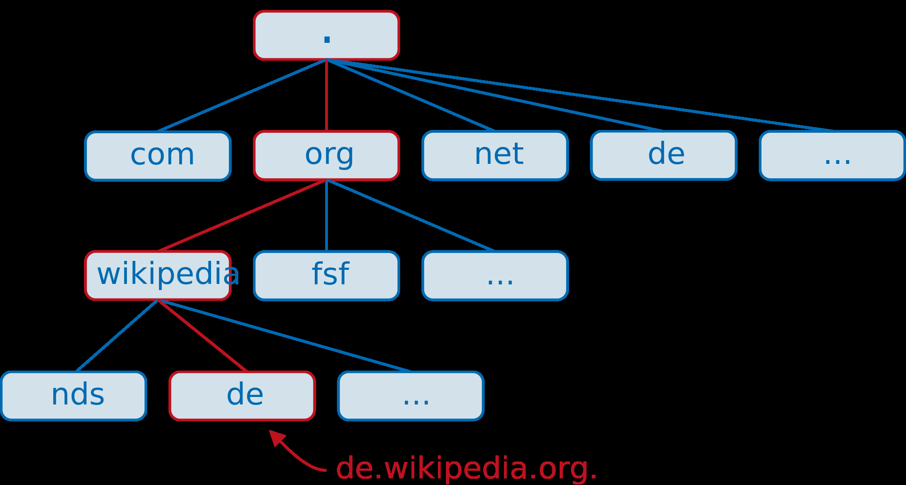

Protokolle
====

Was sind Protokolle
----

- Sind Vereinbarungen für den Austausch von Daten zwischen Computern bzw. Prozessen, welche im Netz miteinander verbunden sind.
- Beinhalten Regeln, Abläufe und Definitionen, in welchem Format die Daten zu übertragen sind und wie sie von der Quelle zum Ziel gelangen
- Je nach Protokoll erfolgt die Datenübertragung verbindungsorientiert, verbindungslos, gesichert oder ungesichert. 
- Beide beteiligten müssen die selben Protokolle verstehen und verwenden, damit der Datenaustausch erfolgt.

ARP - Address Resolution Protocol
----

- In ein Ethernet Lan benötigt jedes Gerät zwei Adressen:
   - MAC
   - IP
- Ist die IP Adresse des Zieles bekannt, jedoch nicht die MAC-Adresse, wird diese mit einem ARP-Request herausgefunden.

ARP-Request
----

- Broadcast mit:
   - Destination MAC: FF-FF-FF-FF-FF-FF
   - Type: 0x806
- Nur das Gerät mit der entsprechenden IP Adresse antwortet, der Rest verwirft den ARP-Request. Mit der Source Mac im ARP-Reply baut das Endgerät dann seine ARP Tabelle.
- Dynamische Einträge werden mit der Zeit wieder gelöscht.
- ``arp -a`` in cmd um die ARP Tabelle zu sehen

HTTP - Hypertext Transfer Protocol
----

- HTTP: Port 80
- Im OSI-Modell auf dem Application Layer 7
- Ist zustandslos ➩ gibt Daten nur zwischen einzelnen Seitenaufrufen weiter
- Cookies sind auch übertragbar ➩ Daten können auch permanent gespeichert werden
- Basiert auf TCP ➩ verlustfrei

| Anfragemethode | Beschreibung |
|:-------------- |:------------ |
| GET            | Datenübertragung per URI |
| POST           | Sensiblere, bzw größere Daten; nicht zwingend in URI |
| HEAD           | Wie GET, ohne eigentlichem Dokumentihalt; Dient zur schnellen Validierung des Browser-Cache |
| PUT            | Dateiupload auf Server |
| PATCH          | Dateiänderung auf Server |
| DELETE         | Dateilöschung auf Server |
| TRACE          | Liefert Anfrage, so wie empfangen, zurück |
| OPTIONS        | Liste von Server-unterstützten Methoden und Merkmale |
| CONNECT        | Implementiert bei Proxyservern mit SSL-Tunnel |

| Statuscodes | Beschreibung             |
|:-----------:|:------------------------:|
| 1xx         | Informationen            |
| 2xx         | Erfolgreiche Operationen |
| 3xx         | Umleitungen              |
| 4xx         | Fehler von Client        |
| 5xx         | Fehler von Server        |

- Unterschied zu HTTPS
   - HTTPS = HTTP Secure
   - HTTPS ist im HTTP mit SSL/TLS-Verschlüsselung
   - Port ist bei HTTPS 443

FTP - File Transfer Protocol
----

- Ist im OSI-Modell auf Transport Layer 7
- Dient zum Datei-Up- und Download
- Arbeitet nach Client-Server-Modell
- Kommunikationsverbindung und Datenverbindung zugleich benötigt
- Kontrollverbindung auf Port 21; Dient für Kommandos
- Datenverbindung auf Port 20; Dient für Datenaustausch

DNS - Domain Name Server
----

- DNS unterstützt den direkten Datenverkehr im Internet, indem es Domainnamen mit tatsächlichen Webservern verbindet.
- DNS kennt keine zentrale “Datenbank”. Die Informationen sind auf vielen tausend DNS-Server verteilt.

DHCP - Dynamic Host Configuration Protocol
----

Ablauf:
1. Client sendet **DHCPDISCOVER**-Paket
2. DHCP-Server beantwortet mit einem **DHCPOFFER**-Paket
3. Client wählt eine aus und informiert diese dann mittels **DHCPREQUEST**-Packet
4. Abschließend bestätigt der Server die TCP/IP-Parameter mittels **DHCPACK**-Packet (**“anerkannt”**).   Bei einer “Fehler” **DHCPNAK**-Paket (**“nicht anerkannt”**).
5. Die IP-Adresse wird in Kombination mit der MAC-Adresse in der Datenbank des Servers gespeichert.
