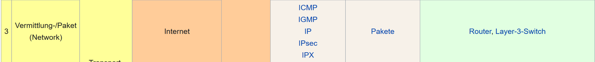
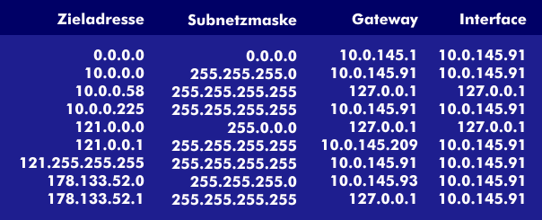

Routing
====

Routing Schemas
----

Die folgenden Routing Schemas veranschaulichen wie Nachrichten in einem Netzwerk übertragen werden können:

- Unicast
   - Eine Nachricht wird an eine spezifische Node gesendet
- Broadcast
   - Nachricht wird an alle Nodes im Netzwerk gesendet
- Multicast
   - Sendet eine Nachricht an alle “interessierten” Nodes
- Anycast
   - Sendet eine Nachricht an irgendeine Nodes aus der Gruppe,
   - meist die nächstliegende Node
   


Routing von Paketen
----

Routing erfolgt beim OSI-Modell in der 3. Schicht 

Man muss die Struktur des Netzes für den ersten Schritt wissen => kann für kleine Netze einfach sein, da man statisch routen kann und somit selbst die Strecke weiß. Bei großen und komplexen Netzen spricht man vom dynamischen Routing (DHCP kommt später). => Strecke im Netz nicht mehr so einfach zu bestimmen!

Geräte, die zum Routen verwendet werden => siehe Bild unterhalb!



Routing von Paketen
----


- SRC-IP: IP, von der das Paket kommt
- Dest-IP: IP, zu der das Paket gesendet werden soll
- SRC-MAC: MAC-Adresse, von der das Paket ausgeht
- DEST-MAC: MAC, zu der das Paket gehen soll

Routing von Paketen, trotz vieler Umwege schnell?
----

Unsere Router verfügen über einen bzw. mehrere Routingtabelle/n, welche den kürzesten, aber auch gleichzeitig logischsten Weg vermerkt haben. Nebenbei spricht man von einer Routen-Metrik, aber was ist das?

Metrik ist ein numerischer Wert, durch diese Wert kann ein Routing-Algorithmus feststellen, welche Route die Beste zum Senden des Paketes ist.

Meistens bestimmt die Metrik die kürzest mögliche Route, also da wo die numerische Zahl klein ist, ist aber nicht immer möglich, da eine höhere Bandbreite benutzt werden könnte, somit wird ein höherer Wert rauskommen => ungünstigerer Weg. 

statisches Routing
----

- Sinnvoll, wenn man ein einfaches Netz aufbauen will, welches schnell eingerichtet werden soll.
- In den sogenannten Zellen werden die besten Wege für die Übertragungsleitung eingetragen, zusammenhängend ist dies mit einer Gewichtung.

statischer Routingtable:


Was sind MAC-Adressen?
----

MAC-Adresse heißt: Media Access Control Address, welche im Gegensatz zu der IP-Adresse einzigartig in jedem Gerät “verankert” ist. Trotz einzigartiger Adresse kann sie durch “Spoofing” - “Täuschungsmethoden” die eigene MAC-Adresse verändern.

Wieso brauchen wir sie?: Sie dient als Kennzeichnung unseres Gerätes in einem Netzwerk. Ebenfalls wird die Adresse dazu benutzt, dass sie vor Kopplungen von falschen Geräten innerhalb eines Netzes schützt bzw. schützen soll.

MAC-Adresse ändern unter Linux: \
Zufällige MAC
```
sudo macchanger -r
```
MAC zurücksetzen
```
sudo macchanger -p
```

Dynamisch (DHCP) - Dynamic Host Configuration Protocol
----

- Sinnvoll bei vielen Hosts oder eher sporadischen Verbindungen
- Automatische weitergabe der Netzwerkinformationen
- Mehrfache Erneuerung der Adressen, gewährleistet eine höhere Sicherheit im Netz
- DHCP Server bietet Angriffspunkte für mögliche Hacker. Durch manipulieren oder vortäuschen des DHCP Servers.


Wie sieht eine MAC-Adresse aus?
----

- ersten 2 Bits geben Auskunft über die Adress-Art an (Einzel-, oder Gruppenadresse)
- Die nächste Ziffernfolge gibt Auskunft über die Herstellerkennung der Netzwerkhardware an
- Die letzte Ziffernfolge gibt Auskunft über die genaue Herstelleradresse an
- Ausführung in hexadezimaler Schreibweise


Router Information Protocol (RIP)
----

Eigenschaften von RIP:
- Updates im Netzwerk werden Periodisch verteilt
- Routing Informationen werden immer Übertragen
- Routing Informationen werden immer von Nachbarsystem empfangen


