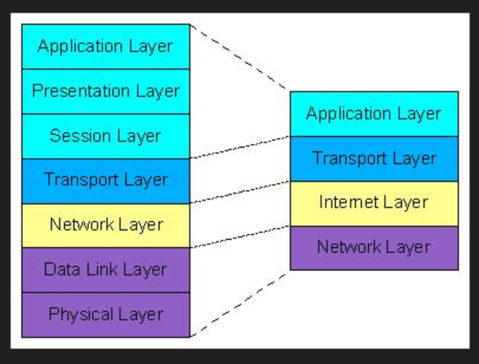

Schichtenmodelle Encapsulation / Protokollheader
====

TCP/IP-Modell / OSI-Modell
----

#### TCP/IP-Modell Layer

1. Network Access
2. Internet
3. Transport
4. Application

#### OSI-Modell Layer

1. Physical
2. Data Link
3. Network
4. Transport
5. Session
6. Presentation
7. Application

#### TCP/IP vs. OSI Modell

- Layer 1 TCP -> Layer 1-2 OSI
- Layer 2 TCP -> Layer 3 OSI
- Layer 3 TCP -> Layer 4 OSI
- Layer 4 TCP -> Layer 5-7

#### Layers des OSI-Model

##### Layer 1 - Physical Layer

- Übertragung von Signalen (mechanisch, elektrisch, …), durch:
   - Kupferkabel
   - Glasfaserkabel
   - Drahtloses Wlan
- Aufgaben:
   - Bits übertragen
   - Mit NIC (Network Interface Card) verbinden
   - Kommunikation mit Layer 2

##### Layer 2 - Data Link Layer

- Zugriff auf physische Adressierung, Fehlererkennung und Mediums.
- Sublayer:
   - LLC (Logical Link Control)
   - MAC (Media Access Control)
- Aufgaben:
   - obere Layern Zugang zum Medium
   - Empfangen und Schreiben von Bits am Medium
   - Austauschung von Frames im Endpunkt
   - Fehlererkennung bzw. Fehlerkorrektur
- Protokolle:
   - Vlans
   - MAC-Table
   - ARP-Table

##### Layer 3 - Network Layer

- Netzwerkübergreifende Adressierung und Routing.
   - Broadcast
   - Multicast
   - Loopback
   - Link-Local-Adresse
- Aufgaben:
   - Endgeräte adressieren
   - Routing, Kommunikation
   - Kapselung und Entkapselung
- Protokolle:
   - IPv4
   - IPv6
   - NAT
   - RIP
   - ICMP
   - ...

##### Layer 4 - Transport Layer

- Segmentierung, Fehlerkorrektur, Pakete verkapseln und Anwendungen unterscheiden
- is ok
   - TCP 
      - zuverlässig
      - wiederholtes Senden
      - Packets ordnen
      - Verbindungsaufbau
   - UDP
      - nicht zuverlässig
      - schnell
- Aufgaben:
   - Anwendungen identifizieren
   - Segmentierung/Multiplexing

##### Layer 5 - Session Layer

- Vermeidung von Session Zusammenbrüchen.
- Aufgaben:
   - Session verwalten
   - Informationen zwischen Client und Server
   - Dialoge verwalten
- Protokolle:
   - ZIP
   - SMPP

##### Layer 6 - Presentation Layer

- Darstellung, Komprimierung und Verschlüsselung von Datenpaketen.
- Aufgaben:
   - Formatierung
   - Komprimierung
   - Verschlüsselung

##### Layer 7 - Application Layer

- zwischen Prozessen Kommunikation aufbauen.
- Aufgaben:
   - Bereitstellung von Anwendungen mit Datenstrukturen
- Protokolle:
   - HTTP, HTTPS
   - POP 3
   - IMAP
   - SMTP

#### Protokoll-Header

##### Wie ist ein Protokoll-Header aufgebaut?

- Aufbau durch Source Address und Destination Address
   - 20 Oktetten
      - Source Adresse / Destination Adresse
         - MAC-Adresse
         - IPv4 Adresse / IPv6 Adresse
      - 32 Bits Dataframe
      - TCP Protokoll
      - Flag (Fragmentierung)
      - Checksum (verlorene Bits)

#### Encapsulation

##### Was ist Encapsulation?

- Einbindung von Datenstrukturen zwischen verschiedenen Layern.
   - Es beginnt mit einem Data Header
   - für das Frame braucht man:
      - einen RTP- Header
      - einen UDP Header 
      - einen IP Header
      - einen Ethernet Header
- Es entstehen durch die Encapsulation:
   - das Data-Segment mit UDP Header
   - das Data-Packet mit IP Header
   - zuletzt das Data-Frame mit Ethernet Header
- Weiterleitung durch Layer 1

