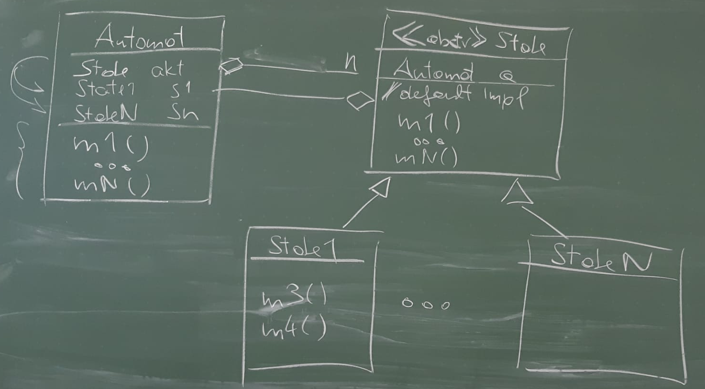

Allgemein
=========

- > _Binnen 1 bis 2 Stund sollte es machbar sein, wenn ma gut is     - Holzmann Andreas_
- Lieber leserlich, als schnell arbeiten
- nicht absolut jedes ``try-catch`` muss geschrieben werden
- Es wird alles einen Zusammenhang haben, anstelle davon, dass nur einzelne Teile gegeben sind (u.A. damit es logischer wird und dass es realitätsnäher ist)


1 JDBC
======

- einen Satz lesen
- mehrere Daten lesen
- ``insert``, ``update``, ``delete``
- Dringend notwending

<details><summary>DB-Manager</summary>

- DBManager:
    ```JAVA
    List<Lieferant> getLieferanten(){ ... }
    ```
- JSP
    ```JSP
    <table>
    <%
        DBManager db = DBManager.getInstance();
        Connection con = db.getConnection();
        List<Lieferant> l = db.getLieferanten(con);
        for(Lieferant li : l){
            out.append("<tr>");
            out.append("<td>" + li.getName() + "</td>");
            ...
            ...
            out.append("<td><a href=\"Aendern.jsp?id=" + li.getId() + "\">update</a></td>");
        }
    %>
    </table>
    ```


</details>


2 JSP
=====

- Tabelle -> ändern eines Datensatzes
    - Auf diesen Teil fokussieren
- Seite wechseln
    - Von Hautpansicht auf Detailansicht soll man wechseln können
- man kann auch ohne leben, wäre aber gut zu wissen
- Ist Serverseitig
- Parameterhandling
- Dispatching
- CSS wird NICHT benötigt


3 Servlets
==========

- AJAX
    - Ist Clientseitig
- JSON
    - GSON ((De-)Serializer)


4 Design Patterns
=================

- UML
    - UML-Klassendiagramm
- Codieren
- Testen
    - nicht so wichtig, aber gut, wenns auf dem Zettel geht
- Zielen immer auf Effizienz und/oder Wartungsvorteile ab
- Klar übersichtliche Code-Teile
- Begründungen
- Beim Observer-Pattern
    - Die Benachrichtigung ist sinnvoller, als die permanente Nachfrage
- State-Pattern
    - Dass die Teile voneinander unabhängig werden
    - Dass die Übersicht nicht verloren geht
- Umfang wird nicht mehr als bei den Tests sein
    - > _Die gesamte Aufgabe soll in 3 Stunden machbar sein     - Holzmann Andreas_


Fokusierte Patterns:

- Observer
- Strategy
- Decorator
- State


<details><summary>UML-Diagramme</summary>

<details><summary>State-Pattern</summary>

Nur die Klasse ``Automat`` ist zu sehen, die anderen Klassen sind intern



</details>

</details>
