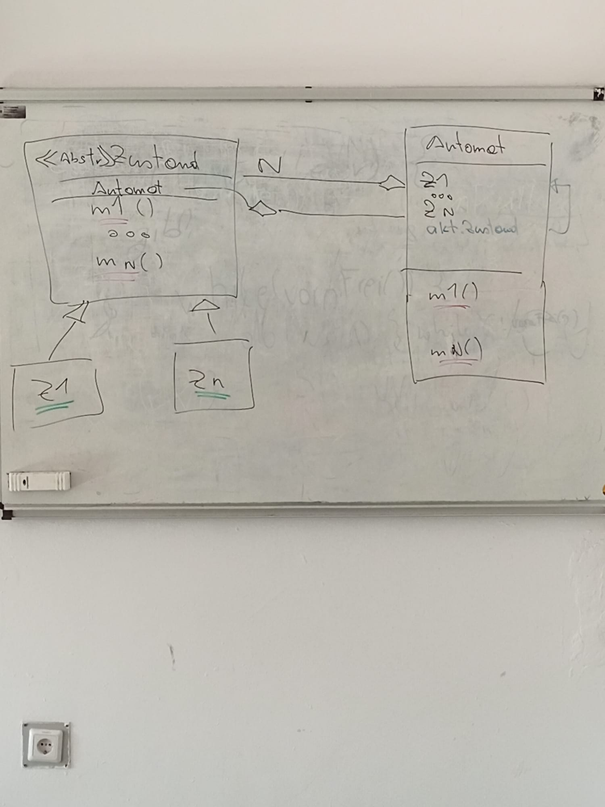
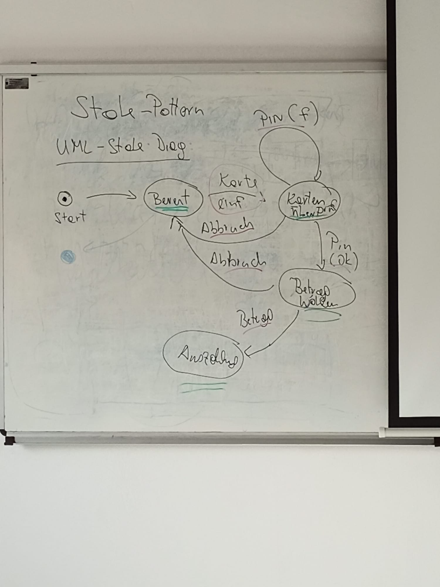
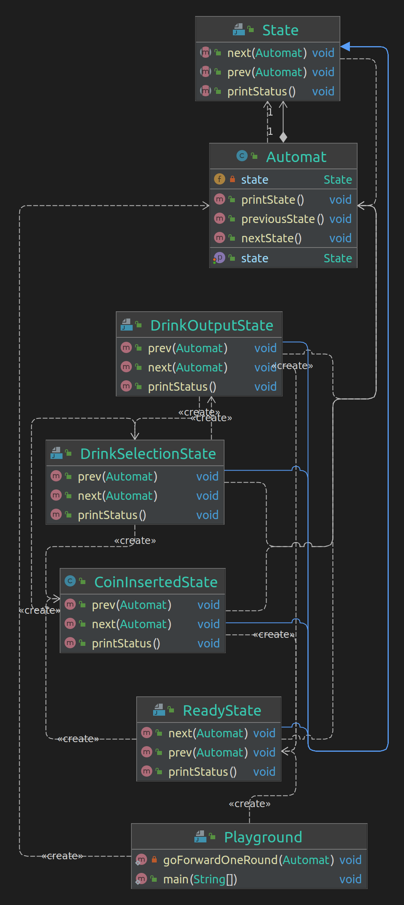

Strategy Pattern
====

Zielt auf austauschbares Verhalten ab. Erklärt mithilfe von Entenjagd mit verschiedenen Enten.

- Klassen
    - Ente
        - implementiert
            - Bewegungsverhalten
- Interfaces
    - Bewegungsverhalten
    - Fliegen
        - erbt von
            - Bewegungsverhalten
    - Schwimmen
        - erbt von
            - Bewegungsverhalten
    - Nicht bewegen
        - erbt von
            - Bewegungsverhalten

Observer Pattern
====

Erklärt mithilfe von Wellensensoren und einer Warnmeldung, die entgegengenommen wird von der Zentrale.

Der Sensor meldet der Zentrale, dass wenn etwas passiert, dies gemeldet werden soll, anstelle davon, dass die Zentrale
bei jedem Sensor nachfragt, ob etwas passiert ist.

- Wer ist der Beobachter?
    - Zentrale
- Wer ist der Beobachtete?
    - Sensor

- Zentrale beobachtet Sensoren
- Signalgeber beobachten Zentrale
    - Wenn Signalgeber bestimmten Wert erhält, soll
        1. Blinker
        2. Sirene

- Observer
    - stellt ``update()``-Methode zur Verfügung mit ``Observer`` und ``deltas`` als Parameter
- Observable
    - ``List<Observer>``
    - ``add(Observer)``
    - ``remove(Observer)``
    - ``notifyAll()``

Command Pattern
====

Man speichert - das Objekt, dessen Methode ausgeführt wurde - die Parameter der Methode - die Methode mit denselben
Parametern desselben Objekts

Grund dafür ist, dass man die Ausführung wiederholen kann

Decorator Pattern
====

Dient zur leichten Erweiterbarkeit

Erklärt anhand von Pizza:

- Man hat einen Teig (Grundbauteil)
- erweitert man mit Tomatensauce (Erweiterung/``Decorator``)
- erweitert man mit Käse (Erweiterung/``Decorator``)
- erweitert man mit ...

Für Programmierer ausgedrückt:

- Man hat ein grundlegendes Interface, welches hinzugefügt werden kann
- Dieses wird vom Grundbauteil implementiert
- Dieses wird vom ``Decorator`` implementiert
    - Diese haben eine Methode ``hasA`` gegenüber dem Interface

State-Pattern
====

This Pattern just goes from one state to another. This example shows it as a beverage-automat

Diagrams

From Whiteboard

    <table>
        <tr>
            <td></td>
            <td></td>
        </tr>
    </table>

From Classes

     

