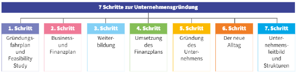

Zusammenfassung UFW Test Nr 3
=============================

Inhaltsverzeichnis
------------------

1. Entrepreneur und Innovation
    1. Einführung
        1. Arten des Entrepreneurships
            1. Originäre Gründungen
            2. Aufbauende Gründungen
        2. Entrepreneur als Wirtschaftsfaktor
        3. Gründe für Selbstständigkeit
        4. Kompetenzen eines Entrepreneurs
    2. Sieben Schritte zur Unternehmensgründung
        1. Gründungsfahrplan und Machbarkeitsstudie (Feasibility Study)
        2. Business- und Finanzplan
        3. Weiterbildung zum Thema Unternehmensgründung
        4. Umsetzung des Finanzplans
        5. Grünung des Unternehmens
        6. Der neue Alltag als Entrepreneur
        7. Unternehmensleitbild und Strukturen
    3. Finanzierung
        1. Förderungen
        2. österreichische Förderstellen
    4. Businessplan
    5. Innovationsmanagement
        1. Innovationsarten
        2. Kreativität
2. Personalmanagement
    1. Einführung
        1. Organisation
            1. Aufgabenstelle
                1. Stellenbeschreibung
            2. Gliederung
            3. Organigramme
            4. Fragen für die Erstellung von Ablauforganisationen
            5. Balkendiagramm (Gant-Diagramm)
            6. Netzplan
            7. Flussdiagramm
        2. Rechtliche Stellung des Mitarbeiters
            1. Arten von Verträgen
            2. Arten von unselbstständigen Beschäftigungsverhältnissen
            3. Stufenbau der Rechtsvorschriften im Arbeitsrecht
        3. Personalverrechnung (Alle Werte sind Stand 2018)
            1. Ermittlung Bruttobetrag
            2. wöchtenliche Normalarbeitszeit
            3. Zuschläge
            4. Zulagen
            5. Sonstige Bezüge
            6. Sachbezüge
            7. Sonderzahlungen
            8. Sozialversicherung
                1. Beitragsgrundlage
                2. Beitragshöhe
                3. Enthaltene Beiträge
            9. Lohnsteuer
                1. Bemessungsgrundlage
                2. Pendlerpauschale
                3. AVAB (**A**llein**v**erdiener**a**bsatz**b**etrag)
                4. Einhebung der Lohnsteuer
                5. Lohnzettel
                6. Personalnebenkosten
                    1. Dienstgeberbeitrag zum Familienlastenausgleichsfond
                    2. zuschlag zum Dienstgeberbeitrag
                    3. Kommunalsteuer
                    4. Wiener Dienstgeberabgabe
                    5. Mitarbeitervorsorgekasse
                    6. Taxe nach dem Behinderteneinstellungsgesetz
    2. Personalplanung
        1. Gründe für kurz- und mittelfristige Schwankungen im Personalbedarf
        2. Gründe für den langfristigen Personalbedarf
    3. Personalbeschaffung
        1. Erstellung eines Anforderungsprofils
            1. Stellenanalyse
            2. Stellenbeschreibung
            3. Stellenspezifikation
        2. Möglichkeiten zur Anwerbung (Recruitment, Personalsuche)
            1. Die Meisten Verfahren
            2. Online Recruitment
            3. Social Media
        3. Gestaltung eines Inserates
            1. Aufbauschema Stelleninserat
        4. Personalleasing
        5. Personalauswahlverfahren
        6. Bewerbermanagement (Wie bewerbe ich mich?)
            1. Informationsbeschaffung
            2. Eigene Webidentität prüfen
            3. Bewerbungsunterlagen
            4. Bewerbungsgesrpäch (Vorstellungsgespräch)
            5. Auswahlverfahren
            6. Was ist ein Assessment-Center? Wie läuft es ab?
        7. Personalauswahl (Aus der Sicht des Unternehmers)
            1. Beurteilung der Bewerbungsunterlagen
            2. Analyse des Bewerbungsgesrpächs
            3. Zusage an den ausgewählten Bewerber
    4. Anstellung
    5. Personalfreisetzung - Fluktuation der Arbeitskräfte
        1. Strategien zur Reduktion einer hohen Fluktuationsrate
        2. Outplacement
        3. Rechtliche Grundlagen bei der Beendigung des Arbeitsverhältnisses
            - Unbefristetes Arbeitsverhältnis
            - Einvernehmlich
            - Kündigung
            - Entlassung
            - Austritt
            - Befristetes Arbeitsverhältnis
    6. Personalentwicklung - Personnel Management
        1. Fehler bei der Beurteilung von Mitarbeitern
        2. Mitarbeiterführung und Kommunikation
        3. Entgelt- und Anreizpolitik

----
----

1 Entrepreneur und Innovation
====

1.1. Einführung
====

- Entrepreneur = Unternehmer
- Unternehmerisch selbstständige Menschen
- Entrepreneurship charakterisiert
    - Persönlichkeit
    - Eigenschaften
    - Unternehmensgründung
    - Unternehmensführung
> _Ein Unternehmen ist jede auf Dauer angelegte Organisation selbstständiger und wirtschaftlicher Tätigkeiten, mag sie auch nicht auf Gewinn ausgerichtet sein._ 
>           _- §1 UGB_

1.1.1. Arten des Entrepreneurships
----

#### 1.1.1.1. Originäre Gründungen

- Traditionelle Gründung
    - Auslöser ist bestehendes Produkts / bestehende Dienstleistung
- Innovative Gründung
    - Auslöser ist neues Produkt / neue Dienstleistung

#### 1.1.1.2. Aufbauende Gründungen

- Erben eines Unternehmens
- Kauf eines bestehenden Unternehmens
- Gemeinschaftlicher Erwerb durch das Management
    - Manager des Unternehmens kaufen das eigene Unternehmen
- Franchising

1.1.2. Entrepreneur als Wirtschaftsfaktor
----

4 Funktionen sind volkswirtschaftlich zu erfüllen:
- Innovationsfunktion
- Wachstumsfunktion
- Beschäftigungsfunktion
- Erhöhung der Unternehmensanzahl

1.1.3. Gründe für Selbstständigkeit
----

- Selbstbestimmung bei der Arbeit
- besseres Einkommen
- mehr Verantwortung im Job
- einzigartige Geschäftsidee
- Unzufriedenheit am Arbeitsplatz
- Wunsch nach mehr Freiraum und Flexibilität
- neue Berufsprespektive aufgrund von Alter/Arbeitslosigkeit
- Traum, sein eigener Chef zu sein
- Betriebsnachfolge
- Erben eines Unternehmens
- bessere Vereinbarkeit von Familie und Beruf
- ...

1.1.4. Kompetenzen eines Entrepreneurs
----

<table>
    <tr>
        <td><strong>Fachliche Kompetenzen</strong></td>
        <td>Fachkenntnisse im Bereich Buchhaltung, Recht, Marketing, Vertriebsfähigkeiten, (Unternehmerprüfung)</td>
    </tr>
    <tr>
        <td><strong>Soziale Kompetenzen</strong></td>
        <td>Teamfähigkeit, Konfliktfähigkeit, Führungsfähigkeit</td>
    </tr>
    <tr>
        <td><strong>Methodische Kompetenzen</strong></td>
        <td>Projektmanagement, Marktkreativität, Kreativitätstechniken, Marktanalysen</td>
    </tr>
    <tr>
        <td><strong>Persönliche Kompetenzen</strong></td>
        <td>Motivation, Eigeninitiative, Risikobereitschaft</td>
    </tr>
</table>

1.2. Sieben Schritte zur Unternehmensgründung
====

1.2.1. Gründungsfahrplan und Machbarkeitsstudie (Feasibility Study)
----

- Machbarkeit und Umsetzbarkeit wird hiermit bewertet
- Gründungsfahrplan stellt richtige Fragen für erfolgreiceh Gründung
- _5 W_'s
    - Was?
    - Wo?
    - Wie?
    - Wer?
    - Wann?
- Teilbereiche
    - Technische Feasibility
    - Markt-Feasibility
    - Feasibility der Organisation
    - Finanzielle Feasibility
    - Feasibility der Rahmenbedingungen

1.2.2. Business- und Finanzplan
----

- Businessplan
    - Präsentiert die Geschäftsidee
    - Zusammefassung aller wesentlichen Inhalte
        - Realisierbarkeit
        - Wirtschaftlichkeit
        - Chancen
        - Risiken
- Finanzplan
    - Eigenfinanzierung
    - Fremdfinanzierung
    - Förderungen

1.2.3. Weiterbildung zum Thema Unternehmensgründung
----

- Schulungen in
    - Gründerakademien
    - Wirtschaftskammer
    - Unternehmensgründerserviceportal
    - Bezirkshauptmannschaft
    - Banken
    - Notare
    - ...

1.2.4. Umsetzung des Finanzplans
----

Finanzplan ist **nicht** deckungsgleich mit Liquiditätsplan!!

1.2.5. Gründung des Unternehmens
----

- Wahl der Rechtsform
- Eintrag ins Firmenbuch?
- Gewerbeberechtigung
    - Jemand mit der entsprechenden GWO muss mindestens Standorleiter sein
    - Anmeldung bei BH oder Stadtmagistrat
- Steuerpflicht
- Versicherungspflicht
- Anmeldung der Arbeitnehmer bei
    - Krankenversicherung
    - Mitarbeitervorsorgekassa
- Firmenwortlaut darf nicht irreführend sein und muss sich eindeutig von anderen unterscheiden

Arten der Geschäftsbezeichnung

| Firma | Firmenschlagwort (Kurzbezeichnung) | Etablissement- oder Geschäftsbezeichnung |
|:--|:--|:--|
| Name des eingetragenen Unternehmens | Firmenname als Schlagwort | Frei gewählte Unternehmensbezeichnung. Geschützt durch Gesetz gegen unlauteren Wettbewerb. Nicht täuschend oder irreführend |

- Wer erteilt die Gewerbeberechtigung?
    - Bezirkshauptmannschaft oder Stadtmagistrat bei Städten mit eigenem Statut
- Was regelt die Gewerbeordnung?
    - Ist ein Bundesgesetz;
    - Regelt: Zugang, Ausübung, Beendigung von Gewerben/gewerbliche Tätigkeiten
- Welche Tätigkeiten unterliegen der GWO?
    - Unternehmerdefinition: Selbstständig (Tätigkeit auf eigene Rechnung und eigene Gefahr), Regelmäßig (Wiederholungsabsicht genügt schon), Ertragserzielungsabsicht
- Welche Tätigkeiten sind von der GWO ausgenommen?
    - Land- und Forstwirtschaftliche Tätigkeiten
    - Freiberufe (Rechtsanwälte, Steuerberater, Ärzte, Architekten, etc.)
    - Neue Selbstständige (Physiotherapeuten, Künstler, Masseur, Vortragende, DJ‘s, etc.)
- Welche Arten von Gewerben gibt es?
    - Freie Gewerbe (Voll geschäftsfähig, keine hohen Finanzstrafen, nur einmal ein unverschuldeter Konkurs vorhanden sein)
    - Reglementierte Gewerbe und Handwerk (Voraussetzung von Freie Gewerbe und zusätzlich:
        - Unternehmerprüfung, Ausbilderprüfung, Befähigungsnachweis)
    - Reglementierte Gewerbe mit Bewilligungspflicht (auch genannt: Rechtskraftgewerbe)
        - (Voraussetzungen von Reglementierte Gewerbe und Handwerk und zusätzlich: Zuverlässigkeitsprüfung)
- Welche Voraussetzungen benötigt man um ein Gewerbe ausüben zu können?
    - Persönliche Voraussetzungen
    - Sachliche Voraussetzungen (muss der Betrieb erfüllen) (Betriebsanlagengenehmigung, geeigneter
    - Standort für Gewerbeausübung, Sicherheitskonzept, Abfallwirtschaftskonzept)
- Was ist eine Betriebsanlage im gewerberechtlichen Sinne?
    - Ausübung der gewerblichen Tätigkeit, Wiederkehrende Tätigkeit, nicht vorübergehender Standort wo die Tätigkeit ausgeführt wird
- In welchen Fällen wird eine Betriebsanlagengenehmigung benötigt?
    - Bei Gefährdung von Leben Gesundheit und/oder Eigentum
    - Die Gefahren von Lärm, Geruch, Vibrationen, Erschütterungen, Staub
- Was ist ein Abfallwirtschaftskonzept und wer muss dieses erstellen?
    - Vermeidung (jeder mit einer genehmigungspflichtigen Betriebsanlage), Verwertung, notfalls ordnungsgemäße Entsorgung?
- Was ist ein Sicherheitskonzept und wer muss dieses erstellen?
    - Betriebe, die gefährliche Stoffe verwenden, müssen ein Sicherheitskonzept erstellen Potenziell gefährdete Einrichtungen (z.B. Schulen, Krankenhäuser, etc.) über Unfälle informieren

1.2.6. Der neue Alltag als Entrepreneur
----

- Selbstmanagement
- Zeitmanagement
    - Ziele festlegen
    - Übersichten festlegen
    - Prioritäten festlegen
    - Einen Plan erstellen
    - Motivation aufbringen

1.2.7. Unternehmensleitbild und Strukturen
----

- Struktur wird immer benötigt
- Wird Unternehmen
    - Aufbauorganisation oder
    - Ablauforganisation
- Organigramm erleichter solche Übersichten

1.3. Finanzierung
====

1.3.1. Förderungen
----

1.2.2. österreichische Förderstellen
----

1.4. Businessplan
====

1.5. Innovationsmanagement
====

1.5.1. Innovationsarten
----

1.5.2. Kreativität
----

2 Personalmanagement
====

2.1. Einführung
====

2.1.1. Organisation
----

#### 2.1.1.1. Aufgabenstelle

###### 2.1.1.1.1. Stellenbeschreibung

#### 2.1.1.2. Gliederung

#### 2.1.1.3. Organigramme

#### 2.1.1.4. Fragen für die Erstellung von Ablauforganisationen

#### 2.1.1.5. Balkendiagramm (Gant-Diagramm)

#### 2.1.1.6. Netzplan

#### 2.1.1.7. Flussdiagramm

2.1.2. Rechtliche Stellung des Mitarbeiters
----

#### 2.1.2.1. Arten von Verträgen

#### 2.1.2.2. Arten von unselbstständigen Beschäftigungsverhältnissen

#### 2.1.2.3. Stufenbau der Rechtsvorschriften im Arbeitsrecht

2.1.3. Personalverrechnung (Alle Werte sind Stand 2018)
----

#### 2.1.3.1. Ermittlung Bruttobetrag

#### 2.1.3.2. wöchtenliche Normalarbeitszeit

#### 2.1.3.3. Zuschläge

#### 2.1.3.4. Zulagen

#### 2.1.3.5. Sonstige Bezüge

#### 2.1.3.6. Sachbezüge

#### 2.1.3.7. Sonderzahlungen

#### 2.1.3.8. Sozialversicherung

###### 2.1.3.8.1. Beitragsgrundlage

###### 2.1.3.8.2. Beitragshöhe

###### 2.1.3.8.3. Enthaltene Beiträge

#### 2.1.3.9. Lohnsteuer

###### 2.1.3.8.1. Bemessungsgrundlage

###### 2.1.3.8.2. Pendlerpauschale

###### 2.1.3.8.3. AVAB (**A**llein**v**erdiener**a**bsatz**b**etrag)

###### 2.1.3.8.4. Einhebung der Lohnsteuer

###### 2.1.3.8.5. Lohnzettel

###### 2.1.3.8.6. Personalnebenkosten

###### 2.1.3.8.6.1. Dienstgeberbeitrag zum Familienlastenausgleichsfond

###### 2.1.3.8.6.2. zuschlag zum Dienstgeberbeitrag

###### 2.1.3.8.6.3. Kommunalsteuer

###### 2.1.3.8.6.4. Wiener Dienstgeberabgabe

###### 2.1.3.8.6.5. Mitarbeitervorsorgekasse

###### 2.1.3.8.6.6. Taxe nach dem Behinderteneinstellungsgesetz

2.2. Personalplanung
====

2.2.1. Gründe für kurz- und mittelfristige Schwankungen im Personalbedarf
----

2.2.2. Gründe für den langfristigen Personalbedarf
----

2.3. Personalbeschaffung
====

2.3.1. Erstellung eines Anforderungsprofils
----

#### 2.3.1.1. Stellenanalyse

#### 2.3.1.2. Stellenbeschreibung

#### 2.3.1.3. Stellenspezifikation

2.3.2. Möglichkeiten zur Anwerbung (Recruitment, Personalsuche)
----

#### 2.3.2.1. Die Meisten Verfahren

#### 2.3.2.2. Online Recruitment

#### 2.3.2.3. Social Media

2.3.3. Gestaltung eines Inserates
----

#### 2.3.3.1. Aufbauschema Stelleninserat

2.3.4. Personalleasing
----

2.3.5. Personalauswahlverfahren
----

2.3.6. Bewerbermanagement (Wie bewerbe ich mich?)
----

#### 2.3.6.1. Informationsbeschaffung

#### 2.3.6.2. Eigene Webidentität prüfen

#### 2.3.6.3. Bewerbungsunterlagen

#### 2.3.6.4. Bewerbungsgesrpäch (Vorstellungsgespräch)

#### 2.3.6.5. Auswahlverfahren

#### 2.3.6.6. Was ist ein Assessment-Center? Wie läuft es ab?

2.3.7. Personalauswahl (Aus der Sicht des Unternehmers)
----

#### 2.3.7.1. Beurteilung der Bewerbungsunterlagen

#### 2.3.7.2. Analyse des Bewerbungsgesrpächs

#### 2.3.7.3. Zusage an den ausgewählten Bewerber

2.4. Anstellung
====

2.5. Personalfreisetzung - Fluktuation der Arbeitskräfte
====

2.5.1. Strategien zur Reduktion einer hohen Fluktuationsrate
----

2.5.2. Outplacement
----

2.5.3. Rechtliche Grundlagen bei der Beendigung des Arbeitsverhältnisses
----

##### Unbefristetes Arbeitsverhältnis

##### Einvernehmlich

##### Kündigung

##### Entlassung

##### Austritt

##### Befristetes Arbeitsverhältnis

2.6. Personalentwicklung - Personnel Management
====

2.6.1. Fehler bei der Beurteilung von Mitarbeitern
----

2.6.2. Mitarbeiterführung und Kommunikation
----

2.6.3. Entgelt- und Anreizpolitik
----
